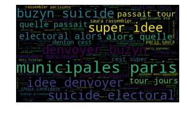
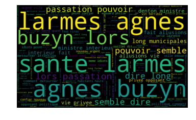

# <font color='burgundy'> <u> Sentimental analysis on tweets: Reaction des francais municipales 2020 ?  </u></font>
## **By Pamela Dekas**


 
**BUT DU PROJET**: 
connaitre l’opinion des français sur les élections municipales de Paris 2020. ceci est un cas d’opinion mining sur une base de tweets recoltés via api

Le cleaning des données s'est fait exclusivement sur python, il nest pas parfait mais fonctionnel

#MunicipalesParis2020


```python
#Nous commencons par importer les librairies nécessaires pour le notebook.
import sys
import csv
import tweepy
import re 
import nltk
import string
import unicodedata
from textblob import TextBlob
from collections import Counter
import pandas as pd
import numpy as np
from nltk.classify import * 
from tweepy.streaming import StreamListener
from tweepy import OAuthHandler
from tweepy import Stream
from nltk.corpus import stopwords
from sklearn.linear_model import LogisticRegression
from sklearn.linear_model import LinearRegression
from sklearn.naive_bayes import MultinomialNB
from sklearn.feature_extraction.text import TfidfVectorizer
from sklearn.metrics import f1_score, roc_auc_score
from sklearn.feature_extraction.text import CountVectorizer
from nltk.tokenize import word_tokenize
import nltk.classify.util
import matplotlib.pyplot as plt
from nltk.tokenize import word_tokenize
from string import punctuation 
from nltk.corpus import stopwords 
```


```python
import csv
import tweepy 
import pandas as pd 
from textblob import TextBlob
import re 
import matplotlib.pyplot as plt

# clés d'authentification fournies par le compte développeur api de twitter
consumer_key = '4JQRjUXKxHWxKYF1XczgL7u4L'
consumer_secret = 'fs0YVnjaKZVWPmYqDqpSKkbSSgFb8Qx62wclbBJTERtIcumQC1'
access_token = '1186207076-QHTRp563cNOKFpZ3X10gguVzS0e6d3MpQPRdH04'
access_token_secret = 'CtTDsbNMs6qSMovjNn0AnzjTRTQQmAZsUCarVEPWTvLvx'


auth = tweepy.OAuthHandler(consumer_key, consumer_secret)
auth.set_access_token(access_token, access_token_secret)
api = tweepy.API(auth,wait_on_rate_limit=True)
    
# définir le formatage des hashtags et des tweets à l'aide de l'encodage utf-8
csvFile = open('Ml.csv', 'a')
csvWriter = csv.writer(csvFile)
writer = csv.writer(csvFile, delimiter=',')
csvWriter.writerow(['timestamp','tweet_text'])

for tweet in tweepy.Cursor(api.search,q="#MunicipalesParis2020", 
                           lang="fr",tweet_mode= "extended",since="2020-02-29").items(200):
       print(tweet.created_at, tweet.full_text)
csvWriter.writerow([tweet.created_at, tweet.full_text.encode('utf-8')])
    
```

    2020-03-08 21:42:40 Retour sous nos fenêtres dans pas longtemps....sauf si on vote bien! #MunicipalesParis2020 https://t.co/3OT2ahFQlc
    2020-03-08 21:41:58 RT @YvesPDB: La bourgeoisie #Buzyn #Pécresse) issue de l’#ENA des grandes écoles et du réseau des laboratoires a retrouvé un role par l’arr…
    2020-03-08 21:41:45 RT @EnsembleEMacron: [#MunicipalesParis2020 🇨🇵] "Il suffit de marcher dans Paris pour voir que c’est un désastre. Dès les 100 premiers jour…
    2020-03-08 21:39:34 RT @sophieaubepine: #MunicipalesParis2020 #Municipales2020 
    Votez pour vous! Avec @Parisien_nes11 er @Parisien_nesNew
    2020-03-08 21:37:50 RT @E_STIBBE: Engagées pour changer Paris!! avec ⁦@JBO_olivier⁩ et ⁦@datirachida⁩ ⁦@LesCentristes_⁩ ⁦@13acoeur⁩ #Paris13 #MunicipalesParis2…
    2020-03-08 21:37:38 RT @EnsembleEMacron: [#MunicipalesParis2020 🇨🇵] "Il suffit de marcher dans Paris pour voir que c’est un désastre. Dès les 100 premiers jour…
    2020-03-08 21:37:30 RT @sophieaubepine: #MunicipalesParis2020 #Municipales2020 
    Votez pour vous! Avec @Parisien_nes11 er @Parisien_nesNew
    2020-03-08 21:34:11 RT @YvesPDB: La bourgeoisie #Buzyn #Pécresse) issue de l’#ENA des grandes écoles et du réseau des laboratoires a retrouvé un role par l’arr…
    2020-03-08 21:31:55 RT @annesouyris: Avec @antoinetteguhl et toutes les candidates féministes et écologistes aux #MunicipalesParis2020 nous sommes prêtes à gou…
    2020-03-08 21:31:55 RT @fchouat: .@MarleneSchiappa 👏 ne pas tomber dans le piège tendu par Hidalgo/Dati sur le 2ème tour! Il faut être d’une grande clarté sur…
    2020-03-08 21:31:52 RT @ViscontiniParis: Vous aussi remplissez la carte #Paris11 @EELVParis11 pour faire connaître vos propositions 🌻👌
    
    #EcologieParis #Municip…
    2020-03-08 21:30:15 RT @Thomas__Elena: @ascoppin Pilier de cet engagement @ascoppin joue un rôle majeur avec les Femmes du #NouveauParis16 , un vision de nouve…
    2020-03-08 21:29:23 RT @EnsembleEMacron: [#MunicipalesParis2020 🇨🇵 #Municipales2020 #Paris2020] "Que les choses soient claires : il n’y aura pas d’alliances d’…
    2020-03-08 21:29:07 RT @EnsembleEMacron: [#MunicipalesParis2020 🇨🇵 #7JoursPourChangerParis] "Cette majorité existe déjà : @dburkli @FBerthout (droite), @f_cala…
    2020-03-08 21:28:58 RT @EnsembleEMacron: [#MunicipalesParis2020 🇨🇵 #Municipales2020 #Paris2020] En essayant de recréer un clivage gauche / droite dans cette él…
    2020-03-08 21:27:11 RT @ManonSLAPORTE: Mes colistiers pour #paris7 avec @VillaniCedric
    
    #municipales2020 #municipales #municipaleparis #municipalesparis2020 #N…
    2020-03-08 21:26:15 RT @Fr_Bechieau: Merci @Khayat_Fouad de rejoindre la belle dynamique avec @David_Belliard et @ecoloparis2020 pour faire gagner le 15 mars l…
    2020-03-08 21:25:55 RT @fagnen_nicolas: Ce soir, @celine_hervieu, candidate à la mairie du 6e arrondissement de #Paris, présente le programme de #ParisEnCommun…
    2020-03-08 21:25:21 RT @fchouat: .@MarleneSchiappa 👏 ne pas tomber dans le piège tendu par Hidalgo/Dati sur le 2ème tour! Il faut être d’une grande clarté sur…
    2020-03-08 21:24:59 @PKOMITES @Gro_ndControl @egregoire Leur « pacte de transition ecologique » : illustration. ... #STOPouEncore ? #MunicipalesParis2020 https://t.co/lHbkvNzDx0
    2020-03-08 21:22:59 RT @LBobant: #8mars #JourneeDeLaFemme : qu’il vente qu’il pleuve les femmes montrent leur engagement pour Paris ! #DatiPourParis #Municipal…
    2020-03-08 21:22:28 RT @Pabloneruda54: ⭕🔴 L'incompétence dans toute sa splendeur ⚡
    #AgnesBuzyn le 24 janvier 
     «Le risque d’importation depuis Wuhan est quasi…
    2020-03-08 21:22:27 RT @JRioufol: #Paris «Il faut une vraie police municipale, il n’y a jamais eu autant de cambriolages dans le 5eme!» @FBerthout au micro de…
    2020-03-08 21:22:20 RT @GaelL23847637: 📩 un seul choix possible le 15/03 pour les #MunicipalesParis2020 : 
    ✅ un candidat fait consensus pour un #NouveauParis :…
    2020-03-08 21:21:41 RT @JoostParis: Peut-on espérer voir s’améliorer le vivre ensemble, l’urbanité et le respect des autres quand on casse systématiquementles…
    2020-03-08 21:20:58 RT @EELVParis12: Candidate écolo du 12ème, @ManoueMarie a signé le @PacteTransition :répondre à l’urgence climatique, arrêter la bétonisati…
    2020-03-08 21:20:38 RT @EELVParis12: Candidate écolo du 12ème, @ManoueMarie a signé le @PacteTransition :répondre à l’urgence climatique, arrêter la bétonisati…
    2020-03-08 21:20:28 RT @VillaniParis17: Le Nouveau Paris dans le 17ème, c'est une super équipe, motivée 😃et dynamique 💪.
    Venez nous rencontrer et échanger sur…
    2020-03-08 21:18:46 RT @HananeAbdelli: Le renouvellement politique à #Paris5 c’est la liste de @VillaniCedric !
    
    #Municipale2020 #Paris5 #MunicipalesParis2020…
    2020-03-08 21:16:38 🚨 le meeting de Rachida Dati et Nicolas Sarkozy officiellement maintenu demain lundi pour les #MunicipalesParis2020
    La jauge de la salle (1020 personnes) légèrement abaissée en raison des nouvelles mesures face au #COVID2019 https://t.co/6RCepCp3Jv
    2020-03-08 21:15:05 RT @VillaniParis17: Le Nouveau Paris dans le 17ème, c'est une super équipe, motivée 😃et dynamique 💪.
    Venez nous rencontrer et échanger sur…
    2020-03-08 21:15:03 RT @Parisien_nes11: Hier comme chaque jour, notre candidat @BastilleCedrick est sur le terrain, dans les marchés et dans les immeubles pour…
    2020-03-08 21:13:04 RT @YvesPDB: La bourgeoisie #Buzyn #Pécresse) issue de l’#ENA des grandes écoles et du réseau des laboratoires a retrouvé un role par l’arr…
    2020-03-08 21:12:56 RT @C_ATLAN_TAPIERO: La gauche fébrile entretient les rumeurs! Depuis quand les socialistes sont-ils progressistes ? Depuis qu’une des leur…
    2020-03-08 21:11:35 IMPORTANT : Ne ratez pas @campion_marcel en direct demain matin, lundi 9 mars 2020 à 7h00 sur @LCI @LaMatinaleLCI @TF1 @TF1LeJT 
    https://t.co/s0ZIexRinB
    #liberonsparis #marcelcampion #leparisdubonsens #propretesecuritemobilite #municipalesparis2020 #LCIdirect https://t.co/SAkT0rROqp
    2020-03-08 21:10:43 RT @YvesPDB: La bourgeoisie #Buzyn #Pécresse) issue de l’#ENA des grandes écoles et du réseau des laboratoires a retrouvé un role par l’arr…
    2020-03-08 21:10:43 RT @EnsembleEMacron: [#MunicipalesParis2020 🇨🇵 #Municipales2020 #Paris2020] "Que les choses soient claires : il n’y aura pas d’alliances d’…
    2020-03-08 21:10:29 RT @LBobant: Échanges riches avec les habitants de#Paris5 autour du programme #DatiPourParis et la liste menée par sa candidate @BirabenAnn…
    2020-03-08 21:09:21 RT @fchouat: .@MarleneSchiappa 👏 ne pas tomber dans le piège tendu par Hidalgo/Dati sur le 2ème tour! Il faut être d’une grande clarté sur…
    2020-03-08 21:08:47 RT @EnsembleEMacron: [#MunicipalesParis2020 🇨🇵] "Il suffit de marcher dans Paris pour voir que c’est un désastre. Dès les 100 premiers jour…
    2020-03-08 21:08:10 RT @JeanMichelAlme1: Ravi d’avoir inauguré  @BastaFesta dans le quartier Pajol La Chapelle avec la team Liscia #AvecLiscia #Paris18 #Munici…
    2020-03-08 21:07:37 RT @YvesPDB: La bourgeoisie #Buzyn #Pécresse) issue de l’#ENA des grandes écoles et du réseau des laboratoires a retrouvé un role par l’arr…
    2020-03-08 21:07:23 RT @fchouat: .@MarleneSchiappa 👏 ne pas tomber dans le piège tendu par Hidalgo/Dati sur le 2ème tour! Il faut être d’une grande clarté sur…
    2020-03-08 21:07:15 RT @JoostParis: Son ambition écologique pour #Paris12 ce sont les verts #EELV qui en parlent le mieux ! #STOPouEncore 😱 #Hidalgo ?? #Munici…
    2020-03-08 21:05:46 RT @Pabloneruda54: ⭕🔴 L'incompétence dans toute sa splendeur ⚡
    #AgnesBuzyn le 24 janvier 
     «Le risque d’importation depuis Wuhan est quasi…
    2020-03-08 21:04:28 RT @VillaniParis20: À Gambetta, plus que jamais mobilisés pour présenter notre programme pour les #MunicipalesParis2020 aux Parisiennes et…
    2020-03-08 21:04:13 RT @EELVParis12: En signant le @PacteTransition, nous avons également approuvé un principe supplémentaire : il concerne les communs, le viv…
    2020-03-08 21:03:31 @ralifromparis Il faut construire l’ #alternance les 2/3 des parisiens l’attendent. Nos politiques leurs doivent. #STOPouEncore 😱 ? #MunicipalesParis2020 #MunicipalesParis
    2020-03-08 21:03:21 RT @Sondeur__: Suite au débat des #MunicipalesParis2020, quel(le) candidat/alliance vous a le plus convaincu(e) ?
    
    1) #Hidalgo #PS #Belliar…
    2020-03-08 21:02:57 RT @NSeddiki: Donc une candidate @DecidonsParis19 est heureuse de la dégradation d’un bâtiment de la ville dont elle entend être élue, just…
    2020-03-08 21:02:12 RT @YvesPDB: La bourgeoisie #Buzyn #Pécresse) issue de l’#ENA des grandes écoles et du réseau des laboratoires a retrouvé un role par l’arr…
    2020-03-08 21:01:38 #MunicipalesParis2020 "Parigo#105 : Les oubliés des transports" : https://t.co/0QMeJWonbL via @YouTube
    2020-03-08 21:01:25 RT @slegrain75: ✊ Dernier dimanche avant le premier tour #Municipales2020 #MunicipalesParis2020 
    Grand Chelem des 3 marchés #Paris19 avec l…
    2020-03-08 21:00:56 @geoffroyboulard @TeamGeoffroy Ce n’est pas une réponse suffisante Monsieur Boulard ! OUI ou NON passerez-vous un accord avec Madame @agnesbuzyn au second tour? Je parie que vous ne me répondrez pas! @CaBouge_PARIS17 @LaREMParis17 @ParisEnCommun17 @datipourparis17 @eelvparis17 #MunicipalesParis2020 #Paris17
    2020-03-08 21:00:46 Son ambition écologique pour #Paris12 ce sont les verts #EELV qui en parlent le mieux ! #STOPouEncore 😱 #Hidalgo ?? #MunicipalesParis2020 #MunicipalesParis https://t.co/jXPuGY1Wap https://t.co/tts3IN7R6X
    2020-03-08 20:59:46 RT @YvesPDB: La bourgeoisie #Buzyn #Pécresse) issue de l’#ENA des grandes écoles et du réseau des laboratoires a retrouvé un role par l’arr…
    2020-03-08 20:59:17 RT @YvesPDB: La bourgeoisie #Buzyn #Pécresse) issue de l’#ENA des grandes écoles et du réseau des laboratoires a retrouvé un role par l’arr…
    2020-03-08 20:59:10 RT @pi2bx: #EngagéspourchangerParis #MunicipalesParis2020
    Une dernière semaine pour convaincre, et toujours plus de retours positifs où il…
    2020-03-08 20:58:32 RT @JeanMichelAlme1: Ravi d’avoir inauguré  @BastaFesta dans le quartier Pajol La Chapelle avec la team Liscia #AvecLiscia #Paris18 #Munici…
    2020-03-08 20:58:14 RT @YvesPDB: La bourgeoisie #Buzyn #Pécresse) issue de l’#ENA des grandes écoles et du réseau des laboratoires a retrouvé un role par l’arr…
    2020-03-08 20:57:06 RT @YvesPDB: La bourgeoisie #Buzyn #Pécresse) issue de l’#ENA des grandes écoles et du réseau des laboratoires a retrouvé un role par l’arr…
    2020-03-08 20:56:56 RT @E_STIBBE: Engagées pour changer Paris!! avec ⁦@JBO_olivier⁩ et ⁦@datirachida⁩ ⁦@LesCentristes_⁩ ⁦@13acoeur⁩ #Paris13 #MunicipalesParis2…
    2020-03-08 20:55:13 @PKOMITES @floracorre @Mairie12Paris @Anne_Hidalgo @Baratti_Elbaz @egregoire @EvelyneHonore Votre suffisance n'a d'égal que votre sens aigu de la concertation et du respect de tous vos administres #Municipales2020 #MunicipalesParis2020
    2020-03-08 20:54:32 [#MunicipalesParis2020 🇨🇵] "Il suffit de marcher dans Paris pour voir que c’est un désastre. Dès les 100 premiers jours, je réorganiserai tous les services de la #propreté à Paris. Il y a une urgence sanitaire" @agnesbuzyn via @ChristineDucros @Mathilde_Sd https://t.co/46RvyioMQJ
    2020-03-08 20:54:31 RT @blacourieux: Anne Hidalgo célèbre la #JourneeDesDroitsDesFemmes en tenant ces propos sur Agnès Buzyn.
    
    Maintenant, imaginez si un homme…
    2020-03-08 20:53:21 RT @Simonnet2: ✊ A la #marchefeministe avec les candidates aux #MunicipalesParis2020 pour @DecidonsParis : @victoiredlm, @pat_pol25 et Ouri…
    2020-03-08 20:53:13 RT @E_STIBBE: Engagées pour changer Paris!! avec ⁦@JBO_olivier⁩ et ⁦@datirachida⁩ ⁦@LesCentristes_⁩ ⁦@13acoeur⁩ #Paris13 #MunicipalesParis2…
    2020-03-08 20:53:05 RT @YvesPDB: La bourgeoisie #Buzyn #Pécresse) issue de l’#ENA des grandes écoles et du réseau des laboratoires a retrouvé un role par l’arr…
    2020-03-08 20:51:57 RT @EELVParis12: En signant le @PacteTransition, nous avons également approuvé un principe supplémentaire : il concerne les communs, le viv…
    2020-03-08 20:51:46 #MunicipalesParis2020 "Les images de la crue de la Seine à Paris" : https://t.co/0NN1yQeZuz via @YouTube
    2020-03-08 20:50:30 RT @YvesPDB: La bourgeoisie #Buzyn #Pécresse) issue de l’#ENA des grandes écoles et du réseau des laboratoires a retrouvé un role par l’arr…
    2020-03-08 20:48:18 RT @A_ZrihenParis20: Au travail dès le 23 mars 2020 pour notre #20e arrdt.
    📰Retrouvez l'interview de Pauline Pellissier journaliste #Monpet…
    2020-03-08 20:48:16 RT @JeanMichelAlme1: Pour donner une nouvelle voix au 18e. Les 15 et 22 mars, faites le choix d’une équipe dynamique encrée dans tous les q…
    2020-03-08 20:47:39 RT @E_STIBBE: Engagées pour changer Paris!! avec ⁦@JBO_olivier⁩ et ⁦@datirachida⁩ ⁦@LesCentristes_⁩ ⁦@13acoeur⁩ #Paris13 #MunicipalesParis2…
    2020-03-08 20:47:38 RT @SingridCampion: Même boycotté par les médias, rien ne pourra faire taire Marcel Campion. Son programme, ses idées, ses ambitions pour P…
    2020-03-08 20:47:04 Engagées pour changer Paris!! avec ⁦@JBO_olivier⁩ et ⁦@datirachida⁩ ⁦@LesCentristes_⁩ ⁦@13acoeur⁩ #Paris13 #MunicipalesParis2020 https://t.co/TczRkYfC8y
    2020-03-08 20:46:59 RT @A_ZrihenParis20: Au travail dès le 23 mars 2020 pour notre #20e arrdt.
    📰Retrouvez l'interview de Pauline Pellissier journaliste #Monpet…
    2020-03-08 20:46:25 RT @YvesPDB: La bourgeoisie #Buzyn #Pécresse) issue de l’#ENA des grandes écoles et du réseau des laboratoires a retrouvé un role par l’arr…
    2020-03-08 20:46:06 RT @JeanMichelAlme1: @PierreLiscia  et son équipe à la rencontre des habitants de #Paris18 pour un samedi riche en échange sur les probléma…
    2020-03-08 20:46:04 RT @LionEngage: Premier tournoi de e-Tennis au #PassingClub #Paris20. @A_ZrihenParis20 bien entouré par Prosper, Sébastien et Pierrick.
    Féd…
    2020-03-08 20:45:52 RT @JeanMichelAlme1: Samedi dernier @PierreLiscia lors d’un débat organisé par @AUCCGUnionCom  a présenté ses principales propositions pour…
    2020-03-08 20:44:54 RT @EELVParis12: En signant le @PacteTransition, nous avons également approuvé un principe supplémentaire : il concerne les communs, le viv…
    2020-03-08 20:44:48 @agnesbuzyn Bla-bla-bla, on vous a vu à l’œuvre pour l’hôpital public alors non merci ! #MunicipalesParis2020 @CaBouge_PARIS17
    2020-03-08 20:44:23 RT @YvesPDB: La bourgeoisie #Buzyn #Pécresse) issue de l’#ENA des grandes écoles et du réseau des laboratoires a retrouvé un role par l’arr…
    2020-03-08 20:43:45 RT @EnsembleEMacron: [#MunicipalesParis2020 🇨🇵 #AvecAgnèsBuzyn] Voilà qui est (re)dit !
    2020-03-08 20:43:21 RT @JeanMichelAlme1: Les Républicains du 18eme ont choisi de soutenir @PierreLiscia  un candidat du 18e actif depuis des années plutôt qu’u…
    2020-03-08 20:42:48 RT @ParisEnCommun19: C’est dimanche prochain que tout se joue, avec @FrancoisDagnaud et toute l’équipe #Le19eEnCommun, on compte sur vous !…
    2020-03-08 20:40:35 Même boycotté par les médias, rien ne pourra faire taire Marcel Campion. Son programme, ses idées, ses ambitions pour Paris seront exposés et entendus lors de son MEETING le mercredi 11 mars 2020 à partir de 18h30 à la place de la République #MunicipalesParis2020
    #Municipales2020 https://t.co/NIQ35Djr7d
    2020-03-08 20:38:40 RT @abbe_jlm: Électeurs du 18ème que j’ai habité pendant 11 ans.. jamais plus vous aurez une telle opportunité au delà des partis pour rest…
    2020-03-08 20:37:38 RT @abbe_jlm: Électeurs du 18ème que j’ai habité pendant 11 ans.. jamais plus vous aurez une telle opportunité au delà des partis pour rest…
    2020-03-08 20:36:26 RT @YvesPDB: La bourgeoisie #Buzyn #Pécresse) issue de l’#ENA des grandes écoles et du réseau des laboratoires a retrouvé un role par l’arr…
    2020-03-08 20:35:56 RT @demontvalon1: #MunicipalesParis2020 Les deux causes de la rupture entre Hidalgo et jDelanoë.
    1. Le « traitement » réservé à Delanoë par…
    2020-03-08 20:35:30 RT @campion_marcel: Et si @campion_marcel était vraiment le Plan B pour Paris vu que 54% des Parisiens ne savent pas pour qui voter ? @RTLF…
    2020-03-08 20:35:08 RT @EELVParis12: 💜💚Ce matin à aligre nous chantons l’hymne des femmes pour le #8mars avec les passantes et notre candidate à la mairie du 1…
    2020-03-08 20:34:37 RT @pauriacombe: Très bon accueil ce matin en cette #JourneeDesDroitsDesFemmes pour notre liste @HannaSEBBAH dans #Paris16 et @agnesbuzyn p…
    2020-03-08 20:34:15 RT @C_ATLAN_TAPIERO: La gauche fébrile entretient les rumeurs! Depuis quand les socialistes sont-ils progressistes ? Depuis qu’une des leur…
    2020-03-08 20:33:51 RT @Pabloneruda54: ⭕🔴 L'incompétence dans toute sa splendeur ⚡
    #AgnesBuzyn le 24 janvier 
     «Le risque d’importation depuis Wuhan est quasi…
    2020-03-08 20:32:21 RT @EELVParis12: En signant le @PacteTransition, nous avons également approuvé un principe supplémentaire : il concerne les communs, le viv…
    2020-03-08 20:31:48 RT @YvesPDB: La bourgeoisie #Buzyn #Pécresse) issue de l’#ENA des grandes écoles et du réseau des laboratoires a retrouvé un role par l’arr…
    2020-03-08 20:30:39 RT @SCharnoz: En nombre au marché #PorteDoree #Paris12 pour ce dernier We avant le 1er tour des #MunicipalesParis2020 : mobilisé.e.s pour é…
    2020-03-08 20:30:25 RT @EELVParis12: En signant le @PacteTransition, nous avons également approuvé un principe supplémentaire : il concerne les communs, le viv…
    2020-03-08 20:30:09 @ralifromparis @pbriday La ligne d’attaque utilisée par l’équipe #Hidalgo démontre une forme de panique, une semaine avant le scrutin des #MunicipalesParis2020. 
    Cette ligne est aussi pathétique que les lignes de métro, empruntées par l’actuelle maire de #Paris, étaient mensongères 😜
    2020-03-08 20:29:57 RT @YvesPDB: La bourgeoisie #Buzyn #Pécresse) issue de l’#ENA des grandes écoles et du réseau des laboratoires a retrouvé un role par l’arr…
    2020-03-08 20:29:25 RT @demontvalon1: #MunicipalesParis2020 Les deux causes de la rupture entre Hidalgo et jDelanoë.
    1. Le « traitement » réservé à Delanoë par…
    2020-03-08 20:26:56 RT @demontvalon1: #MunicipalesParis2020 Les deux causes de la rupture entre Hidalgo et jDelanoë.
    1. Le « traitement » réservé à Delanoë par…
    2020-03-08 20:23:20 RT @C_ATLAN_TAPIERO: La gauche fébrile entretient les rumeurs! Depuis quand les socialistes sont-ils progressistes ? Depuis qu’une des leur…
    2020-03-08 20:23:19 RT @EELVParis12: En signant le @PacteTransition, nous avons également approuvé un principe supplémentaire : il concerne les communs, le viv…
    2020-03-08 20:22:48 RT @EELVParis12: Candidate écolo du 12ème, @ManoueMarie a signé le @PacteTransition :répondre à l’urgence climatique, arrêter la bétonisati…
    2020-03-08 20:22:34 RT @YvesPDB: La bourgeoisie #Buzyn #Pécresse) issue de l’#ENA des grandes écoles et du réseau des laboratoires a retrouvé un role par l’arr…
    2020-03-08 20:22:20 RT @BOrdenner: @extraordener 👉https://t.co/n9mk1yshxh notre projet est devenu un réel enjeu de la campagne #MunicipalesParis2020 #Municipal…
    2020-03-08 20:21:41 RT @fchouat: .@MarleneSchiappa 👏 ne pas tomber dans le piège tendu par Hidalgo/Dati sur le 2ème tour! Il faut être d’une grande clarté sur…
    2020-03-08 20:20:28 RT @pauriacombe: Très bon accueil ce matin en cette #JourneeDesDroitsDesFemmes pour notre liste @HannaSEBBAH dans #Paris16 et @agnesbuzyn p…
    2020-03-08 20:20:25 RT @demontvalon1: #MunicipalesParis2020 Les deux causes de la rupture entre Hidalgo et jDelanoë.
    1. Le « traitement » réservé à Delanoë par…
    2020-03-08 20:20:22 RT @Valeurs: ➡️ @BertrandDelanoe reproche à @Anne_Hidalgo d’avoir été “très dure” avec lui pendant son mandat et pourrait le lui faire paye…
    2020-03-08 20:19:30 RT @annesouyris: Pour une parfaite égalité des droits entre les femmes et les hommes. #marchefeministe 
    #JourneeDesDroitsDesFemmes  @ecolop…
    2020-03-08 20:18:50 RT @EELVParis12: Candidate écolo du 12ème, @ManoueMarie a signé le @PacteTransition :répondre à l’urgence climatique, arrêter la bétonisati…
    2020-03-08 20:18:05 RT @campion_marcel: Et si @campion_marcel était vraiment le Plan B pour Paris vu que 54% des Parisiens ne savent pas pour qui voter ? @RTLF…
    2020-03-08 20:18:03 RT @EELVParis12: En signant le @PacteTransition, nous avons également approuvé un principe supplémentaire : il concerne les communs, le viv…
    2020-03-08 20:17:58 RT @fchouat: .@MarleneSchiappa 👏 ne pas tomber dans le piège tendu par Hidalgo/Dati sur le 2ème tour! Il faut être d’une grande clarté sur…
    2020-03-08 20:17:40 RT @SchonAlexandre: [⏱️ABSENTÉISME de @datirachida à #Paris #LaGrandeConfrontation #MunicipalesParis2020 ]
    🚨54 minutes de prise de parole a…
    2020-03-08 20:14:38 RT @JRioufol: #Paris «Il faut une vraie police municipale, il n’y a jamais eu autant de cambriolages dans le 5eme!» @FBerthout au micro de…
    2020-03-08 20:14:15 RT @EELVParis12: En signant le @PacteTransition, nous avons également approuvé un principe supplémentaire : il concerne les communs, le viv…
    2020-03-08 20:13:34 RT @Parisien_nes11: Hier comme chaque jour, notre candidat @BastilleCedrick est sur le terrain, dans les marchés et dans les immeubles pour…
    2020-03-08 20:13:20 RT @EELVParis12: En signant le @PacteTransition, nous avons également approuvé un principe supplémentaire : il concerne les communs, le viv…
    2020-03-08 20:12:59 RT @ValeryVuong: Au marché des Pyrénées, le dernier marché du week-end de la campagne, nous sommes déjà un peu nostalgique. 
    Notre liste ci…
    2020-03-08 20:12:49 RT @EcologieParis7: Pour des actions concrètes en faveur des animaux dans le 7eme arrondissement, voter @ecoloparis2020 avec Denis Gouzerh…
    2020-03-08 20:12:16 RT @Csagaspe: Au marché d’Aligre avec @David_Belliard et @JoelleMorel11 pour la dernière ligne droite #MunicipalesParis2020 #EcologieParis…
    2020-03-08 20:11:47 En signant le @PacteTransition, nous avons également approuvé un principe supplémentaire : il concerne les communs, le vivre ensemble et la transversalité du féminisme. Il faut penser nos politiques locales sous le regard du genre ! #8mars #ecologieParis #MunicipalesParis2020 https://t.co/2k6T8UDpYM
    2020-03-08 20:11:08 @extraordener 👉https://t.co/n9mk1yshxh notre projet est devenu un réel enjeu de la campagne #MunicipalesParis2020 #Municipales2020  @voteParis2020 la preuve que les enjeux de justice sociale et d’environnement dans le 18e sont une reelle volonté des habitants. #onlacherien 📢🐛 https://t.co/Ot0HS6j9Ds
    2020-03-08 20:11:04 RT @demontvalon1: #MunicipalesParis2020 Les deux causes de la rupture entre Hidalgo et jDelanoë.
    1. Le « traitement » réservé à Delanoë par…
    2020-03-08 20:09:54 RT @demontvalon1: #MunicipalesParis2020 Les deux causes de la rupture entre Hidalgo et jDelanoë.
    1. Le « traitement » réservé à Delanoë par…
    2020-03-08 20:09:52 RT @EnsembleEMacron: [#MunicipalesParis2020 🇨🇵 #Municipales2020 #Paris2020] "Que les choses soient claires : il n’y aura pas d’alliances d’…
    2020-03-08 20:09:39 RT @JRioufol: #Paris «Il faut une vraie police municipale, il n’y a jamais eu autant de cambriolages dans le 5eme!» @FBerthout au micro de…
    2020-03-08 20:08:49 RT @EnsembleEMacron: [#MunicipalesParis2020 🇨🇵 #Municipales2020 #Paris2020] "Que les choses soient claires : il n’y aura pas d’alliances d’…
    2020-03-08 20:07:20 RT @demontvalon1: #MunicipalesParis2020 Les deux causes de la rupture entre Hidalgo et jDelanoë.
    1. Le « traitement » réservé à Delanoë par…
    2020-03-08 20:06:51 RT @demontvalon1: #MunicipalesParis2020 Les deux causes de la rupture entre Hidalgo et jDelanoë.
    1. Le « traitement » réservé à Delanoë par…
    2020-03-08 20:06:25 RT @demontvalon1: #MunicipalesParis2020 Les deux causes de la rupture entre Hidalgo et jDelanoë.
    1. Le « traitement » réservé à Delanoë par…
    2020-03-08 20:06:24 RT @demontvalon1: #MunicipalesParis2020 Les deux causes de la rupture entre Hidalgo et jDelanoë.
    1. Le « traitement » réservé à Delanoë par…
    2020-03-08 20:04:39 RT @EnsembleEMacron: [#MunicipalesParis2020 🇨🇵 #Municipales2020 #Paris2020] "Que les choses soient claires : il n’y aura pas d’alliances d’…
    2020-03-08 20:03:55 RT @EnsembleEMacron: [#MunicipalesParis2020 🇨🇵 #Municipales2020 #Paris2020] En essayant de recréer un clivage gauche / droite dans cette él…
    2020-03-08 20:03:28 RT @JRioufol: #Paris «#Paris doit devenir une ville zéro déchet comme #SanFrancisco » @David_Belliard au micro de @andrebercoff dans #CielM…
    2020-03-08 20:03:28 RT @ViscontiniParis: Vous aussi remplissez la carte #Paris11 @EELVParis11 pour faire connaître vos propositions 🌻👌
    
    #EcologieParis #Municip…
    2020-03-08 20:03:22 RT @CaBouge_PARIS17: #Municipales2020 #MunicipalesParis2020  le vote est droit, Voter est un devoir citoyen. https://t.co/a1PQt9JLP8
     Le 15…
    2020-03-08 20:03:10 RT @JRioufol: #Paris «Il faut une vraie police municipale, il n’y a jamais eu autant de cambriolages dans le 5eme!» @FBerthout au micro de…
    2020-03-08 20:02:57 RT @annesouyris: Avec @antoinetteguhl et toutes les candidates féministes et écologistes aux #MunicipalesParis2020 nous sommes prêtes à gou…
    2020-03-08 20:02:41 RT @cynosophes: Il est temps de changer les choses à @Mairie12Paris !! Vous fermez les espaces de liberté pour nos chiens nous vous chasser…
    2020-03-08 20:02:24 RT @alexandra_mnt: « Est-ce si difficile de dire je suis fidèle à ma famille? »
    Merci @francoisbaroin pour votre soutien !
    
    👉 @AgnesEvren e…
    2020-03-08 20:02:10 RT @Simonnet2: ✊ A la #marchefeministe avec les candidates aux #MunicipalesParis2020 pour @DecidonsParis : @victoiredlm, @pat_pol25 et Ouri…
    2020-03-08 20:00:38 RT @JRioufol: #Paris « J’ai mis depuis le début la #culture au coeur de mon programme pour le Vème arrondissement » @FBerthout au micro de…
    2020-03-08 19:58:52 RT @JRioufol: #Paris «Il faut une vraie police municipale, il n’y a jamais eu autant de cambriolages dans le 5eme!» @FBerthout au micro de…
    2020-03-08 19:58:29 RT @campion_marcel: Et si @campion_marcel était vraiment le Plan B pour Paris vu que 54% des Parisiens ne savent pas pour qui voter ? @RTLF…
    2020-03-08 19:57:50 RT @campion_marcel: Et si @campion_marcel était vraiment le Plan B pour Paris vu que 54% des Parisiens ne savent pas pour qui voter ? @RTLF…
    2020-03-08 19:57:42 RT @beausire: @RemiFeraud @ACORDEBARD Vu l’etat de #paris10 apres votre mandature &amp; celle d’ @ACORDEBARD, vu le ras le bol des hab. : insec…
    2020-03-08 19:57:41 RT @EnsembleEMacron: [#MunicipalesParis2020 🇨🇵 #Municipales2020 #Paris2020] "Que les choses soient claires : il n’y aura pas d’alliances d’…
    2020-03-08 19:56:58 RT @Simonnet2: ✊ A la #marchefeministe avec les candidates aux #MunicipalesParis2020 pour @DecidonsParis : @victoiredlm, @pat_pol25 et Ouri…
    2020-03-08 19:56:27 RT @campion_marcel: Quand @Francetele refuse à @campion_marcel de participer au débat du 10 mars 2020 dans le cadre de l'émission consacrée…
    2020-03-08 19:56:23 RT @campion_marcel: Allez-y bande de #moutons, votez pour la #corruption 
    @Anne_Hidalgo ! Signé @campion_marcel  le CENSURÉ
    #liberonsparis…
    2020-03-08 19:56:04 RT @campion_marcel: ❌ Le débat des municipales 2020 pour Paris : Marcel Campion exclu, HALTE A LA CENSURE ❌❌
    #liberonsparis #marcelcampion…
    2020-03-08 19:55:46 RT @campion_marcel: @campion_marcel : Ma candidature et mon éviction des débats. La censure de @LCI et autres continue...
    #liberonsparis #m…
    2020-03-08 19:55:29 RT @campion_marcel: JE SUIS EXCLU DU DÉBAT de ce soir sur @LCI de @24hPujadas ! C’est une #honte, et #antidémocratique.
    @campion_marcel 
    #l…
    2020-03-08 19:55:16 [#MunicipalesParis2020 🇨🇵 #7JoursPourChangerParis] "Cette majorité existe déjà : @dburkli @FBerthout (droite), @f_calandra @S_Mazetier (gauche), @pybournazel (centre). Pas venus sur un accord politicien, mais pour construire cette majorité de projet."
    ➡️ https://t.co/JlbPCxhQuw https://t.co/6LETbbYuIJ
    2020-03-08 19:55:12 RT @JassieKiddo: Une super intervention de Clément Bony tête de liste Décidons Paris dans le 12ème au débat sur le pacte pour la transition…
    2020-03-08 19:54:05 RT @campion_marcel: 🚨🇫🇷🚨 Signez la #pétition pour que @campion_marcel soit présent sur @France2tv au débat des municipales 2020 le 10 mars…
    2020-03-08 19:53:43 RT @campion_marcel: France 3 Ile de France 🇫🇷 @campion_marcel 
    https://t.co/s0ZIexzGZ1
    #liberonsparis #marcelcampion #leparisdubonsens #pro…
    2020-03-08 19:53:00 RT @campion_marcel: @campion_marcel sur @LCI : le sondage de l'Ifop 15% des intentions  de vote.
    #liberonsparis #marcelcampion #leparisdubo…
    2020-03-08 19:52:51 RT @pauriacombe: Très bon accueil ce matin en cette #JourneeDesDroitsDesFemmes pour notre liste @HannaSEBBAH dans #Paris16 et @agnesbuzyn p…
    2020-03-08 19:52:46 RT @ParisEnCommun19: C’est dimanche prochain que tout se joue, avec @FrancoisDagnaud et toute l’équipe #Le19eEnCommun, on compte sur vous !…
    2020-03-08 19:52:39 RT @Pabloneruda54: ⭕🔴 L'incompétence dans toute sa splendeur ⚡
    #AgnesBuzyn le 24 janvier 
     «Le risque d’importation depuis Wuhan est quasi…
    2020-03-08 19:52:37 RT @EnsembleEMacron: [#MunicipalesParis2020 🇨🇵 #Municipales2020 #Paris2020] En essayant de recréer un clivage gauche / droite dans cette él…
    2020-03-08 19:52:35 RT @campion_marcel: JE SUIS EXCLU DU DÉBAT de ce soir sur @LCI de @24hPujadas ! C’est une #honte, et #antidémocratique.
    @campion_marcel 
    #l…
    2020-03-08 19:52:23 RT @ralifromparis: Pourquoi @datirachida refuse-t-elle d’aller sur @RADIOJ94_8FM alors même qu’on assiste à une explosion des actes antisem…
    2020-03-08 19:51:10 Ce qu’on retiendra d’Anne #Hidalgo comme maire de Paris: la destruction de ce patrimoine de l’humanité #NotreDamedeParis 
    #MunicipalesParis2020 https://t.co/NuJBtBVZty
    2020-03-08 19:50:43 RT @Parisien_nes11: Hier très belle soirée pour notre meeting « Vivre mieux dans #Paris11 » 
    
    Encore merci de votre présence, de l’accueil…
    2020-03-08 19:48:01 RT @EnsembleEMacron: [#MunicipalesParis2020 🇨🇵 #Municipales2020 #Paris2020] "Que les choses soient claires : il n’y aura pas d’alliances d’…
    2020-03-08 19:47:59 RT @YvesPDB: Une originalité de campagne ! Un bus électrique pour la campagne #Villani ! C’est original meme si cela ne fait pas des voix #…
    2020-03-08 19:47:00 [#MunicipalesParis2020 🇨🇵 #Municipales2020 #Paris2020] En essayant de recréer un clivage gauche / droite dans cette élection municipale, Mesdames #Dati et #Hidalgo enferment les Parisiens dans des logiques d’appareils dont ils ne veulent plus. ➡️ https://t.co/JlbPCxhQuw https://t.co/U3sshTSoNH
    2020-03-08 19:44:20 [#MunicipalesParis2020 🇨🇵 #Municipales2020 #Paris2020] "Que les choses soient claires : il n’y aura pas d’alliances d’appareils au soir du 1er tour entre @agnesbuzyn et R. #Dati ! via @ParisEnsemble75 ➡️ https://t.co/JlbPCxhQuw https://t.co/nXK06DwVAX
    2020-03-08 19:43:27 Pourquoi @datirachida refuse-t-elle d’aller sur @RADIOJ94_8FM alors même qu’on assiste à une explosion des actes antisemites à Paris ? 
    
    Étonnant !
    
    #MunicipalesParis2020 https://t.co/K41LCJjFVG
    2020-03-08 19:43:05 RT @F_Liblin: 🙆‍♂️ Unis et motivés comme jamais pour faire gagner @PacomeRupin, le meilleur candidat en capacité de  répondre aux attentes…
    2020-03-08 19:42:30 RT @annesouyris: En cette #JourneeDesDroitsDesFemmes  aujourd'hui à midi pile, sur la seule place du 13e commémorant un féminicide, nous re…
    2020-03-08 19:40:18 RT @demontvalon1: #MunicipalesParis2020 Les deux causes de la rupture entre Hidalgo et jDelanoë.
    1. Le « traitement » réservé à Delanoë par…
    2020-03-08 19:39:25 RT @demontvalon1: #MunicipalesParis2020 Les deux causes de la rupture entre Hidalgo et jDelanoë.
    1. Le « traitement » réservé à Delanoë par…
    2020-03-08 19:38:17 RT @Fr_Bechieau: Merci @Khayat_Fouad de rejoindre la belle dynamique avec @David_Belliard et @ecoloparis2020 pour faire gagner le 15 mars l…
    2020-03-08 19:37:25 RT @JeanMichelAlme1: Pour donner une nouvelle voix au 18e. Les 15 et 22 mars, faites le choix d’une équipe dynamique encrée dans tous les q…
    2020-03-08 19:37:13 RT @Fr_Bechieau: Merci @Khayat_Fouad de rejoindre la belle dynamique avec @David_Belliard et @ecoloparis2020 pour faire gagner le 15 mars l…
    2020-03-08 19:37:11 RT @annesouyris: Pour une parfaite égalité des droits entre les femmes et les hommes. #marchefeministe 
    #JourneeDesDroitsDesFemmes  @ecolop…
    2020-03-08 19:36:27 RT @iris75018: Merci @PierreLiscia de mettre en lumière ce sujet tellement important et délaissé #JourneeDesDroitsDesFemmes #8mars #AvecLis…
    2020-03-08 19:35:53 RT @YvesPDB: La bourgeoisie #Buzyn #Pécresse) issue de l’#ENA des grandes écoles et du réseau des laboratoires a retrouvé un role par l’arr…
    2020-03-08 19:35:39 RT @annesouyris: Contre les violences faites aux femmes, il faut agir maintenant et à tous les niveaux ! #MunicipalesParis2020
    2020-03-08 19:33:28 RT @Parisien_nes11: Hier comme chaque jour, notre candidat @BastilleCedrick est sur le terrain, dans les marchés et dans les immeubles pour…
    2020-03-08 19:33:09 RT @LaREMParis6: Aux grandes femmes la Patrie reconnaissante 🙏💙 #8MARS2020 #8mars 
    
    #TousAvecAgnesBuzyn #TousAvecGaspardGantzer pour les #M…
    2020-03-08 19:32:27 RT @ValeryVuong: Au marché des Pyrénées, le dernier marché du week-end de la campagne, nous sommes déjà un peu nostalgique. 
    Notre liste ci…
    2020-03-08 19:32:13 RT @Parisien_nes11: Hier très belle soirée pour notre meeting « Vivre mieux dans #Paris11 » 
    
    Encore merci de votre présence, de l’accueil…
    2020-03-08 19:29:41 RT @PCentreEnCommun: 😳 Dans la k-riole d'@ArielWeilT... une surprise !
    
    😂😂 @boris_tweets a besoin de souffler un peu, non ?
    
    ➡️➡️ #Hidalgo2…
    2020-03-08 19:29:06 RT @YvesPDB: La bourgeoisie #Buzyn #Pécresse) issue de l’#ENA des grandes écoles et du réseau des laboratoires a retrouvé un role par l’arr…
    2020-03-08 19:27:59 RT @YvesPDB: La bourgeoisie #Buzyn #Pécresse) issue de l’#ENA des grandes écoles et du réseau des laboratoires a retrouvé un role par l’arr…
    2020-03-08 19:26:46 RT @YvesPDB: La bourgeoisie #Buzyn #Pécresse) issue de l’#ENA des grandes écoles et du réseau des laboratoires a retrouvé un role par l’arr…
    2020-03-08 19:26:12 RT @YvesPDB: La bourgeoisie #Buzyn #Pécresse) issue de l’#ENA des grandes écoles et du réseau des laboratoires a retrouvé un role par l’arr…
    2020-03-08 19:25:05 #8mars #JourneeDeLaFemme : qu’il vente qu’il pleuve les femmes montrent leur engagement pour Paris ! #DatiPourParis #MunicipalesParis2020 @BirabenAnne #Paris5 https://t.co/u923AYrVKD
    2020-03-08 19:23:48 RT @YvesPDB: La bourgeoisie #Buzyn #Pécresse) issue de l’#ENA des grandes écoles et du réseau des laboratoires a retrouvé un role par l’arr…
    


    226


```python
tweets = pd.read_csv('tweetsfinal.csv')
```


```python
df = pd.DataFrame(tweets)
#df= df.drop([0,1], axis = 0)
print (df.head(10))
```

                   date                                         tweet_text
    0  29/02/2020 13:53   @agnesbuzyn Vous avez fait deja combien de #V...
    1  29/02/2020 13:52  #pariscitoyen #MunicipalesParis2020 retrouvez ...
    2  29/02/2020 13:28  Des candidat.e.s #UrgenceEcologie #Paris mobil...
    3  29/02/2020 13:28  ...et le prix de la plus belle affiche : @eelv...
    4  29/02/2020 13:06  Un scandale ! Les parisiens #Pietons abandonne...
    5  29/02/2020 12:10  Les ecologistes du 20eme etaient ce matin avec...
    6  29/02/2020 11:36  Superbe accueil ce matin au marche #Poncelet a...
    7  29/02/2020 11:29  Le #Paris de @Anne_Hidalgo et sa majorite actu...
    8  29/02/2020 11:22  En route pr animer debat entre citoyens engage...
    9  29/02/2020 11:16  Rachida Dati a des soutiens de poids de droite...
    


```python
print("Dataset size:", len(df))
```

    Dataset size: 29648
    


```python
df['tweet_text']= df = df.drop('date', 1)
df.head(5)
```


<div>
<style scoped>
    .dataframe tbody tr th:only-of-type {
        vertical-align: middle;
    }

    .dataframe tbody tr th {
        vertical-align: top;
    }

    .dataframe thead th {
        text-align: right;
    }
</style>
<table border="1" class="dataframe">
  <thead>
    <tr style="text-align: right;">
      <th></th>
      <th>tweet_text</th>
    </tr>
  </thead>
  <tbody>
    <tr>
      <th>0</th>
      <td>@agnesbuzyn Vous avez fait deja combien de #V...</td>
    </tr>
    <tr>
      <th>1</th>
      <td>#pariscitoyen #MunicipalesParis2020 retrouvez ...</td>
    </tr>
    <tr>
      <th>2</th>
      <td>Des candidat.e.s #UrgenceEcologie #Paris mobil...</td>
    </tr>
    <tr>
      <th>3</th>
      <td>...et le prix de la plus belle affiche : @eelv...</td>
    </tr>
    <tr>
      <th>4</th>
      <td>Un scandale ! Les parisiens #Pietons abandonne...</td>
    </tr>
  </tbody>
</table>
</div>


```python
df['tweet_text'] =df['tweet_text'].apply(str.lower)
df.head(5)
```


<div>
<style scoped>
    .dataframe tbody tr th:only-of-type {
        vertical-align: middle;
    }

    .dataframe tbody tr th {
        vertical-align: top;
    }

    .dataframe thead th {
        text-align: right;
    }
</style>
<table border="1" class="dataframe">
  <thead>
    <tr style="text-align: right;">
      <th></th>
      <th>tweet_text</th>
    </tr>
  </thead>
  <tbody>
    <tr>
      <th>0</th>
      <td>@agnesbuzyn vous avez fait deja combien de #v...</td>
    </tr>
    <tr>
      <th>1</th>
      <td>#pariscitoyen #municipalesparis2020 retrouvez ...</td>
    </tr>
    <tr>
      <th>2</th>
      <td>des candidat.e.s #urgenceecologie #paris mobil...</td>
    </tr>
    <tr>
      <th>3</th>
      <td>...et le prix de la plus belle affiche : @eelv...</td>
    </tr>
    <tr>
      <th>4</th>
      <td>un scandale ! les parisiens #pietons abandonne...</td>
    </tr>
  </tbody>
</table>
</div>


```python
import nltk
nltk.download('punkt')
```

    [nltk_data] Downloading package punkt to C:\Users\Marie de La
    [nltk_data]     Côdre\AppData\Roaming\nltk_data...
    [nltk_data]   Unzipping tokenizers\punkt.zip.
    


    True


### <font color='blue'> Les entrées de chaîne sont difficiles à traiter car ce type de données est fondamentalement différent du langage informatique natif.
utilisation des librairies textblob et NLTK pour le traitement de ce type de data.</font>

#### PREPROCESSING 

ici, nettoyage de base du texte( les emojis, caractères spéciaux, les tags...)


```python
#Emoji patterns
emoji_pattern = re.compile("["
         u"\U0001F600-\U0001F64F"  # emoticones
         u"\U0001F300-\U0001F5FF"  # symboles & pictogrammes
         u"\U0001F680-\U0001F6FF"  # Symboles des transports et cartes
         u"\U0001F1E0-\U0001F1FF"  # Drapeaux (iOS)
         u"\U00002702-\U000027B0"
         u"\U000024C2-\U0001F251"
         "]+", flags=re.UNICODE)
```


```python
def remove_non_ASCII(text):
    return ''.join([i if ord(i)< 128 else '' for i in text])
```


```python
df['tweet_text']= df['tweet_text'].apply(remove_non_ASCII)
# Montrer les tweets nettoyés
df.head(5)
```


<div>
<style scoped>
    .dataframe tbody tr th:only-of-type {
        vertical-align: middle;
    }

    .dataframe tbody tr th {
        vertical-align: top;
    }

    .dataframe thead th {
        text-align: right;
    }
</style>
<table border="1" class="dataframe">
  <thead>
    <tr style="text-align: right;">
      <th></th>
      <th>tweet_text</th>
    </tr>
  </thead>
  <tbody>
    <tr>
      <th>0</th>
      <td>@agnesbuzyn vous avez fait deja combien de #v...</td>
    </tr>
    <tr>
      <th>1</th>
      <td>#pariscitoyen #municipalesparis2020 retrouvez ...</td>
    </tr>
    <tr>
      <th>2</th>
      <td>des candidat.e.s #urgenceecologie #paris mobil...</td>
    </tr>
    <tr>
      <th>3</th>
      <td>...et le prix de la plus belle affiche : @eelv...</td>
    </tr>
    <tr>
      <th>4</th>
      <td>un scandale ! les parisiens #pietons abandonne...</td>
    </tr>
  </tbody>
</table>
</div>


```python
# Creation d'une fonction permettant de nettoyer les tweets
def Text_cleansing(text):
    text = re.sub('@[A-Za-z0–9]+', '', str(text))#Enlever les tags @
    text = re.sub('#', '', text) # Enlever les '#' hash tag
    text = re.sub('rt', '', text)
    text = re.sub('RT[\s]+', '', text) # Enelever RT
    text = re.sub('https?:\/\/\S+', '', text) # Enelever hyperlink
    text = re.sub(r'[^\x00-\x7F]+',' ', text)
    text = emoji_pattern.sub(r'', text)
    text = re.sub(r'[\xe2\x80\x99]+',' ', text) # remplace l'apostrophe 
    text = re.sub(r'[\xc3\xaa]+','e', text)#remplace   
    text = re.sub(r'[\xc3\xa0]+',' ', text)
    text = re.sub(r'[\xF0\x9F\x98\x81]+',' ', text)
    text = re.sub(r'[\xF0\x9F\x98\x8C]+',' ', text)
    text = re.sub(r'[\xF0\x9F\x99\x8C]+',' ', text)
    text = re.sub(r'[\xF0\x9F\x99\x8F]+',' ', text)
    text = re.sub(r'[\xE2\x9C\x8A]+',' ', text)
    text = re.sub(r'[\xF0\x9F\x91\x8C]+',' ', text)
    text = re.sub(r'[\xF0\x9F\x91\x8D]+',' ', text)
    text = re.sub(r'[\xF0\x9F\x91\x8F]+',' ', text)
    text = re.sub(r'[\xF0\x9F\x92\xAA]+',' ', text)
    text = re.sub(r'[\xF0\x9F\x94\xA5]+',' ', text)
    text = re.sub(r'[\xF0\x9F\x98\x82]+',' ', text)
    text = re.sub(r'[\xF0\x9F\x98\x92]+',' ', text)
    text = re.sub(r'[\xF0\x9F\x98\xA0]+',' ', text)
    text = re.sub(r'[\xF0\x9F\x98\xA1]+',' ', text)
    text = re.sub(r'[\xF0\x9F\x98\xA4]+',' ', text)
    text = re.sub(r'[\xF0\x9F\x98\xA9]+',' ', text)
    text = re.sub(r'[\xF0\x9F\x98\xAA]+',' ', text)
    text = re.sub(r'[\xF0\x9F\x91\x8E]+',' ', text)
    text = re.sub(r'[\xF0\x9F\x92\x94]+',' ', text)
    text = re.sub(r'[\xF0\x9F\x92\xA2]+',' ', text)
    text = re.sub(r'[\xF0\x9F\x98\xAC]+',' ', text)
    text = re.sub(r'[\xF0]+',' ', text)
    text = re.sub(r'[\xF0\x9F\x98\xB4]+',' ', text)
    text = re.sub(r"$\d+\W+|\b\d+\b|\W+\d+$", "", text)
    text=re.sub(',',' ', text)
    text=re.sub('!',' ',text)
    text=re.sub(':',' ',text)
    text=re.sub("'","",text)
    text=re.sub('"','',text)
    text = emoji_pattern.sub(r'',text)
    text = word_tokenize(text)
    word_stopwords = set(stopwords.words('french') + list(punctuation) + ['AT_USER','URL'])
    
    return [word for word in text if word not in word_stopwords]
    return text
   
    


```


```python
# Nettoyage des tweets
df['cleaned_tweets']= df['tweet_text'].apply(Text_cleansing)
# Montrer les tweets nettoyés
df.head(5)
```


    ---------------------------------------------------------------------------

    LookupError                               Traceback (most recent call last)

    c:\users\marie de la côdre\appdata\local\programs\python\python37\lib\site-packages\nltk\corpus\util.py in __load(self)
         85                 try:
    ---> 86                     root = nltk.data.find('{}/{}'.format(self.subdir, zip_name))
         87                 except LookupError:
    

    c:\users\marie de la côdre\appdata\local\programs\python\python37\lib\site-packages\nltk\data.py in find(resource_name, paths)
        700     resource_not_found = '\n%s\n%s\n%s\n' % (sep, msg, sep)
    --> 701     raise LookupError(resource_not_found)
        702 
    

    LookupError: 
    **********************************************************************
      Resource stopwords not found.
      Please use the NLTK Downloader to obtain the resource:
    
      >>> import nltk
      >>> nltk.download('stopwords')
      
      For more information see: https://www.nltk.org/data.html
    
      Attempted to load corpora/stopwords.zip/stopwords/
    
      Searched in:
        - 'C:\\Users\\Marie de La Côdre/nltk_data'
        - 'c:\\users\\marie de la côdre\\appdata\\local\\programs\\python\\python37\\nltk_data'
        - 'c:\\users\\marie de la côdre\\appdata\\local\\programs\\python\\python37\\share\\nltk_data'
        - 'c:\\users\\marie de la côdre\\appdata\\local\\programs\\python\\python37\\lib\\nltk_data'
        - 'C:\\Users\\Marie de La Côdre\\AppData\\Roaming\\nltk_data'
        - 'C:\\nltk_data'
        - 'D:\\nltk_data'
        - 'E:\\nltk_data'
    **********************************************************************
    

    
    During handling of the above exception, another exception occurred:
    

    LookupError                               Traceback (most recent call last)

    <ipython-input-13-18d6f632c589> in <module>
          1 # Clean the tweets
    ----> 2 df['cleaned_tweets']= df['tweet_text'].apply(Text_cleansing)
          3 # Show the cleaned tweets
          4 df.head(5)
    

    c:\users\marie de la côdre\appdata\local\programs\python\python37\lib\site-packages\pandas\core\series.py in apply(self, func, convert_dtype, args, **kwds)
       4043             else:
       4044                 values = self.astype(object).values
    -> 4045                 mapped = lib.map_infer(values, f, convert=convert_dtype)
       4046 
       4047         if len(mapped) and isinstance(mapped[0], Series):
    

    pandas/_libs/lib.pyx in pandas._libs.lib.map_infer()
    

    <ipython-input-12-2a94bd106f43> in Text_cleansing(text)
         42     text = emoji_pattern.sub(r'',text)
         43     text = word_tokenize(text)
    ---> 44     word_stopwords = set(stopwords.words('french') + list(punctuation) + ['AT_USER','URL'])
         45 
         46     return [word for word in text if word not in word_stopwords]
    

    c:\users\marie de la côdre\appdata\local\programs\python\python37\lib\site-packages\nltk\corpus\util.py in __getattr__(self, attr)
        121             raise AttributeError("LazyCorpusLoader object has no attribute '__bases__'")
        122 
    --> 123         self.__load()
        124         # This looks circular, but its not, since __load() changes our
        125         # __class__ to something new:
    

    c:\users\marie de la côdre\appdata\local\programs\python\python37\lib\site-packages\nltk\corpus\util.py in __load(self)
         86                     root = nltk.data.find('{}/{}'.format(self.subdir, zip_name))
         87                 except LookupError:
    ---> 88                     raise e
         89 
         90         # Load the corpus.
    

    c:\users\marie de la côdre\appdata\local\programs\python\python37\lib\site-packages\nltk\corpus\util.py in __load(self)
         81         else:
         82             try:
    ---> 83                 root = nltk.data.find('{}/{}'.format(self.subdir, self.__name))
         84             except LookupError as e:
         85                 try:
    

    c:\users\marie de la côdre\appdata\local\programs\python\python37\lib\site-packages\nltk\data.py in find(resource_name, paths)
        699     sep = '*' * 70
        700     resource_not_found = '\n%s\n%s\n%s\n' % (sep, msg, sep)
    --> 701     raise LookupError(resource_not_found)
        702 
        703 
    

    LookupError: 
    **********************************************************************
      Resource stopwords not found.
      Please use the NLTK Downloader to obtain the resource:
    
      >>> import nltk
      >>> nltk.download('stopwords')
      
      For more information see: https://www.nltk.org/data.html
    
      Attempted to load corpora/stopwords
    
      Searched in:
        - 'C:\\Users\\Marie de La Côdre/nltk_data'
        - 'c:\\users\\marie de la côdre\\appdata\\local\\programs\\python\\python37\\nltk_data'
        - 'c:\\users\\marie de la côdre\\appdata\\local\\programs\\python\\python37\\share\\nltk_data'
        - 'c:\\users\\marie de la côdre\\appdata\\local\\programs\\python\\python37\\lib\\nltk_data'
        - 'C:\\Users\\Marie de La Côdre\\AppData\\Roaming\\nltk_data'
        - 'C:\\nltk_data'
        - 'D:\\nltk_data'
        - 'E:\\nltk_data'
    **********************************************************************
    


```python
def Tweet_polarity(filtered_tweet):
    return TextBlob(filtered_tweet).sentiment.polarity

def Tweet_subjectivity(filtered_tweet): 
    return TextBlob(filtered_tweet).sentiment.subjectivity


```


```python
df['cleaned_tweets']= df['cleaned_tweets'].apply(str)
df.head(20)
```


    ---------------------------------------------------------------------------

    KeyError                                  Traceback (most recent call last)

    c:\users\marie de la côdre\appdata\local\programs\python\python37\lib\site-packages\pandas\core\indexes\base.py in get_loc(self, key, method, tolerance)
       2896             try:
    -> 2897                 return self._engine.get_loc(key)
       2898             except KeyError:
    

    pandas/_libs/index.pyx in pandas._libs.index.IndexEngine.get_loc()
    

    pandas/_libs/index.pyx in pandas._libs.index.IndexEngine.get_loc()
    

    pandas/_libs/hashtable_class_helper.pxi in pandas._libs.hashtable.PyObjectHashTable.get_item()
    

    pandas/_libs/hashtable_class_helper.pxi in pandas._libs.hashtable.PyObjectHashTable.get_item()
    

    KeyError: 'cleaned_tweets'

    
    During handling of the above exception, another exception occurred:
    

    KeyError                                  Traceback (most recent call last)

    <ipython-input-15-846e57cd67e4> in <module>
    ----> 1 df['cleaned_tweets']= df['cleaned_tweets'].apply(str)
          2 df.head(20)
    

    c:\users\marie de la côdre\appdata\local\programs\python\python37\lib\site-packages\pandas\core\frame.py in __getitem__(self, key)
       2993             if self.columns.nlevels > 1:
       2994                 return self._getitem_multilevel(key)
    -> 2995             indexer = self.columns.get_loc(key)
       2996             if is_integer(indexer):
       2997                 indexer = [indexer]
    

    c:\users\marie de la côdre\appdata\local\programs\python\python37\lib\site-packages\pandas\core\indexes\base.py in get_loc(self, key, method, tolerance)
       2897                 return self._engine.get_loc(key)
       2898             except KeyError:
    -> 2899                 return self._engine.get_loc(self._maybe_cast_indexer(key))
       2900         indexer = self.get_indexer([key], method=method, tolerance=tolerance)
       2901         if indexer.ndim > 1 or indexer.size > 1:
    

    pandas/_libs/index.pyx in pandas._libs.index.IndexEngine.get_loc()
    

    pandas/_libs/index.pyx in pandas._libs.index.IndexEngine.get_loc()
    

    pandas/_libs/hashtable_class_helper.pxi in pandas._libs.hashtable.PyObjectHashTable.get_item()
    

    pandas/_libs/hashtable_class_helper.pxi in pandas._libs.hashtable.PyObjectHashTable.get_item()
    

    KeyError: 'cleaned_tweets'


```python
df['Subjectivity'] = df['cleaned_tweets'].apply(Tweet_subjectivity)
df['Polarity'] = df['cleaned_tweets'].apply(Tweet_polarity)
df.head(25)
```


<div>
<style scoped>
    .dataframe tbody tr th:only-of-type {
        vertical-align: middle;
    }

    .dataframe tbody tr th {
        vertical-align: top;
    }

    .dataframe thead th {
        text-align: right;
    }
</style>
<table border="1" class="dataframe">
  <thead>
    <tr style="text-align: right;">
      <th></th>
      <th>tweet_text</th>
      <th>cleaned_tweets</th>
      <th>Subjectivity</th>
      <th>Polarity</th>
    </tr>
  </thead>
  <tbody>
    <tr>
      <th>0</th>
      <td>@agnesbuzyn vous avez fait deja combien de #v...</td>
      <td>['fait', 'deja', 'combien', 'victimes', 'mos',...</td>
      <td>0.0</td>
      <td>0.0</td>
    </tr>
    <tr>
      <th>1</th>
      <td>#pariscitoyen #municipalesparis2020 retrouvez ...</td>
      <td>['pariscitoyen', 'municipalesparis2020', 'retr...</td>
      <td>0.0</td>
      <td>0.0</td>
    </tr>
    <tr>
      <th>2</th>
      <td>des candidat.e.s #urgenceecologie #paris mobil...</td>
      <td>['candidat.e.s', 'urgenceecologie', 'paris', '...</td>
      <td>0.0</td>
      <td>0.0</td>
    </tr>
    <tr>
      <th>3</th>
      <td>...et le prix de la plus belle affiche : @eelv...</td>
      <td>['...', 'prix', 'plus', 'belle', 'affiche', 'm...</td>
      <td>0.0</td>
      <td>0.0</td>
    </tr>
    <tr>
      <th>4</th>
      <td>un scandale ! les parisiens #pietons abandonne...</td>
      <td>['scandale', 'parisiens', 'pietons', 'abandonn...</td>
      <td>0.0</td>
      <td>0.0</td>
    </tr>
    <tr>
      <th>5</th>
      <td>les ecologistes du 20eme etaient ce matin avec...</td>
      <td>['ecologistes', '20eme', 'etaient', 'matin', '...</td>
      <td>0.1</td>
      <td>0.1</td>
    </tr>
    <tr>
      <th>6</th>
      <td>superbe accueil ce matin au marche #poncelet a...</td>
      <td>['superbe', 'accueil', 'matin', 'marche', 'pon...</td>
      <td>0.0</td>
      <td>0.0</td>
    </tr>
    <tr>
      <th>7</th>
      <td>le #paris de @anne_hidalgo et sa majorite actu...</td>
      <td>['paris', '_hidalgo', 'majorite', 'actuelle', ...</td>
      <td>0.0</td>
      <td>0.0</td>
    </tr>
    <tr>
      <th>8</th>
      <td>en route pr animer debat entre citoyens engage...</td>
      <td>['route', 'pr', 'animer', 'debat', 'entre', 'c...</td>
      <td>0.0</td>
      <td>0.0</td>
    </tr>
    <tr>
      <th>9</th>
      <td>rachida dati a des soutiens de poids de droite...</td>
      <td>['rachida', 'dati', 'a', 'soutiens', 'poids', ...</td>
      <td>0.0</td>
      <td>0.0</td>
    </tr>
    <tr>
      <th>10</th>
      <td>#municipalesparis2020 : 13e a proximite de la ...</td>
      <td>['municipalesparis2020', '13e', 'a', 'proximit...</td>
      <td>0.0</td>
      <td>0.0</td>
    </tr>
    <tr>
      <th>11</th>
      <td>signez la petition @ https://t.co/3tmbe4wmv0 #...</td>
      <td>['signez', 'petition', 'municipalesparis2020',...</td>
      <td>0.0</td>
      <td>0.0</td>
    </tr>
    <tr>
      <th>12</th>
      <td>vous vous interrogez sur votre vote pour la ma...</td>
      <td>['interrogez', 'vote', 'mairie', '18eme', 'arr...</td>
      <td>0.0</td>
      <td>0.0</td>
    </tr>
    <tr>
      <th>13</th>
      <td>@francarina22 @ccastaner @emmanuelmacron ils ...</td>
      <td>['testent', 'soumission', 'humaniste', 'demain...</td>
      <td>0.0</td>
      <td>0.0</td>
    </tr>
    <tr>
      <th>14</th>
      <td>#buzyn #buzyn2020 #election2020 #electionsmun...</td>
      <td>['buzyn', 'buzyn2020', 'election2020', 'electi...</td>
      <td>0.0</td>
      <td>0.0</td>
    </tr>
    <tr>
      <th>15</th>
      <td>@tommydevito78 sutout ne pas voter #buzyn  au...</td>
      <td>['sutout', 'voter', 'buzyn', 'electionsmunicip...</td>
      <td>0.0</td>
      <td>0.0</td>
    </tr>
    <tr>
      <th>16</th>
      <td>la mairie toujours en extase pour defendre un...</td>
      <td>['mairie', 'toujours', 'extase', 'defendre', '...</td>
      <td>0.0</td>
      <td>0.0</td>
    </tr>
    <tr>
      <th>17</th>
      <td>depuis la mediatheque jean ferrat au palais s...</td>
      <td>['depuis', 'mediatheque', 'jean', 'ferrat', 'p...</td>
      <td>0.0</td>
      <td>0.0</td>
    </tr>
    <tr>
      <th>18</th>
      <td>@audreylive14 @aziereeric @marleneschiappa @p...</td>
      <td>['...']</td>
      <td>0.0</td>
      <td>0.0</td>
    </tr>
    <tr>
      <th>19</th>
      <td>quel programme pour les chiens dans le 12eme ...</td>
      <td>['quel', 'programme', 'chiens', '12eme', 'gran...</td>
      <td>1.0</td>
      <td>0.5</td>
    </tr>
    <tr>
      <th>20</th>
      <td>la meilleure arme contre #lrem #municipalespa...</td>
      <td>['meilleure', 'arme', 'contre', 'lrem', 'munic...</td>
      <td>0.0</td>
      <td>0.0</td>
    </tr>
    <tr>
      <th>21</th>
      <td>ah quand meme #municipalesparis2020 https://t...</td>
      <td>['ah', 'quand', 'meme', 'municipalesparis2020']</td>
      <td>0.0</td>
      <td>0.0</td>
    </tr>
    <tr>
      <th>22</th>
      <td>#municipalesparis2020 #le19eencommun #lesdeba...</td>
      <td>['municipalesparis2020', 'le19eencommun', 'les...</td>
      <td>0.0</td>
      <td>0.0</td>
    </tr>
    <tr>
      <th>23</th>
      <td>#municipalesparis2020  #mgp2020 ledevenirdela...</td>
      <td>['municipalesparis2020', 'mgp2020', 'ledevenir...</td>
      <td>0.0</td>
      <td>0.0</td>
    </tr>
    <tr>
      <th>24</th>
      <td>le #rechauffement climatique exige des mesure...</td>
      <td>['rechauffement', 'climatique', 'exige', 'mesu...</td>
      <td>0.0</td>
      <td>0.0</td>
    </tr>
  </tbody>
</table>
</div>


```python
def result_analysis(text):

            analysis = TextBlob(text)
            # print(analysis.sentiment)  # print tweet's polarity
            #polarity += analysis.sentiment.polarity  # adding up polarities to find the average later

            if (analysis.sentiment.polarity == 0):  # adding reaction of how people are reacting to find average later
             return 'neutral' 
            elif (analysis.sentiment.polarity) > 0 :
               return 'positive'
            elif (analysis.sentiment.polarity) < 0: 
               return  'negative'
```


```python
df['Analysis'] = df['cleaned_tweets'].apply(result_analysis)
df.head(7)
```


<div>
<style scoped>
    .dataframe tbody tr th:only-of-type {
        vertical-align: middle;
    }

    .dataframe tbody tr th {
        vertical-align: top;
    }

    .dataframe thead th {
        text-align: right;
    }
</style>
<table border="1" class="dataframe">
  <thead>
    <tr style="text-align: right;">
      <th></th>
      <th>tweet_text</th>
      <th>cleaned_tweets</th>
      <th>Subjectivity</th>
      <th>Polarity</th>
      <th>Analysis</th>
    </tr>
  </thead>
  <tbody>
    <tr>
      <th>0</th>
      <td>@agnesbuzyn vous avez fait deja combien de #v...</td>
      <td>['fait', 'deja', 'combien', 'victimes', 'mos',...</td>
      <td>0.0</td>
      <td>0.0</td>
      <td>neutral</td>
    </tr>
    <tr>
      <th>1</th>
      <td>#pariscitoyen #municipalesparis2020 retrouvez ...</td>
      <td>['pariscitoyen', 'municipalesparis2020', 'retr...</td>
      <td>0.0</td>
      <td>0.0</td>
      <td>neutral</td>
    </tr>
    <tr>
      <th>2</th>
      <td>des candidat.e.s #urgenceecologie #paris mobil...</td>
      <td>['candidat.e.s', 'urgenceecologie', 'paris', '...</td>
      <td>0.0</td>
      <td>0.0</td>
      <td>neutral</td>
    </tr>
    <tr>
      <th>3</th>
      <td>...et le prix de la plus belle affiche : @eelv...</td>
      <td>['...', 'prix', 'plus', 'belle', 'affiche', 'm...</td>
      <td>0.0</td>
      <td>0.0</td>
      <td>neutral</td>
    </tr>
    <tr>
      <th>4</th>
      <td>un scandale ! les parisiens #pietons abandonne...</td>
      <td>['scandale', 'parisiens', 'pietons', 'abandonn...</td>
      <td>0.0</td>
      <td>0.0</td>
      <td>neutral</td>
    </tr>
    <tr>
      <th>5</th>
      <td>les ecologistes du 20eme etaient ce matin avec...</td>
      <td>['ecologistes', '20eme', 'etaient', 'matin', '...</td>
      <td>0.1</td>
      <td>0.1</td>
      <td>positive</td>
    </tr>
    <tr>
      <th>6</th>
      <td>superbe accueil ce matin au marche #poncelet a...</td>
      <td>['superbe', 'accueil', 'matin', 'marche', 'pon...</td>
      <td>0.0</td>
      <td>0.0</td>
      <td>neutral</td>
    </tr>
  </tbody>
</table>
</div>


```python
#df.to_csv('labelisedTweets', encoding='utf-8', index=False)
```

**Data Visualization**

exploration rapide, premier checfk sur l'attribution des sentiments.


```python
# vue sur les tweets les plus négatifs

print('Printing negative tweets:\n')
j=1
sortedDF = df.sort_values(by=['Polarity'],ascending=False) #Sort the tweets
for i in range(0, sortedDF.shape[0] ):
  if( sortedDF['Polarity'][i] < -0.3):
    print(str(j) + ') '+sortedDF['tweet_text'][i])
    print()
    j=j+1


```

    Printing negative tweets:
    
    1)  je comprends pas comment on peut avoir autant de medias differents et une information aussi merdique. impossible de... https://t.co/qiutjgibs2';
    
    2)  @florentjrg entre autres #fail #lameduck #hidalgo =&gt; #municipalesparis2020 #municipalesparis #parisencommun... https://t.co/ksjn7ner4d'
    
    3)  vers une vague verte aux #municipales2020 !#urgenceecologie #ecologieparis #municipalesparis2020  @ecoloparis2020 ... https://t.co/1zbapcbpfp';
    
    4)  voila votre -savoir faire- en la matiere =&gt;  #pietons #fail #hidalgo #paris10 #paris12 #pariscentre #thetimeisup... https://t.co/xg320sfoff'
    
    5)  \x96\x8b [signatures a venir] vague de signatures ! - lundi @villanicedric ! - mercredi @david_belliard @ecoloparis2020... https://t.co/fu1ftxi3tx';
    
    6)  @lyeslouffok aussi vague et impuissante que les reponses de #versini a mes questions en conseil de #paris #municipalesparis2020';
    
    7)  @anne_hidalgo une baisse 2x moins rapide que dans les 6 precedentes annees #fail #hidalgo #municipalesparis2020';
    
    8)  je comprends pas comment on peut avoir autant de medias differents et une information aussi merdique. impossible de... https://t.co/qiutjgibs2';
    
    9)  @florentjrg entre autres #fail #lameduck #hidalgo =&gt; #municipalesparis2020 #municipalesparis #parisencommun... https://t.co/ksjn7ner4d'
    
    10)  vers une vague verte aux #municipales2020 !#urgenceecologie #ecologieparis #municipalesparis2020  @ecoloparis2020 ... https://t.co/1zbapcbpfp';
    
    11)  voila votre -savoir faire- en la matiere =&gt;  #pietons #fail #hidalgo #paris10 #paris12 #pariscentre #thetimeisup... https://t.co/xg320sfoff'
    
    12)  \x96\x8b [signatures a venir] vague de signatures ! - lundi @villanicedric ! - mercredi @david_belliard @ecoloparis2020... https://t.co/fu1ftxi3tx';
    
    13)  @lyeslouffok aussi vague et impuissante que les reponses de #versini a mes questions en conseil de #paris #municipalesparis2020';
    
    14)  @anne_hidalgo une baisse 2x moins rapide que dans les 6 precedentes annees #fail #hidalgo #municipalesparis2020';
    
    15)  je comprends pas comment on peut avoir autant de medias differents et une information aussi merdique. impossible de... https://t.co/qiutjgibs2';
    
    16)  @florentjrg entre autres #fail #lameduck #hidalgo =&gt; #municipalesparis2020 #municipalesparis #parisencommun... https://t.co/ksjn7ner4d'
    
    17)  vers une vague verte aux #municipales2020 !#urgenceecologie #ecologieparis #municipalesparis2020  @ecoloparis2020 ... https://t.co/1zbapcbpfp';
    
    18)  voila votre -savoir faire- en la matiere =&gt;  #pietons #fail #hidalgo #paris10 #paris12 #pariscentre #thetimeisup... https://t.co/xg320sfoff'
    
    19)  \x96\x8b [signatures a venir] vague de signatures ! - lundi @villanicedric ! - mercredi @david_belliard @ecoloparis2020... https://t.co/fu1ftxi3tx';
    
    20)  @lyeslouffok aussi vague et impuissante que les reponses de #versini a mes questions en conseil de #paris #municipalesparis2020';
    
    21)  @anne_hidalgo une baisse 2x moins rapide que dans les 6 precedentes annees #fail #hidalgo #municipalesparis2020';
    
    22)  je comprends pas comment on peut avoir autant de medias differents et une information aussi merdique. impossible de... https://t.co/qiutjgibs2';
    
    23)  @florentjrg entre autres #fail #lameduck #hidalgo =&gt; #municipalesparis2020 #municipalesparis #parisencommun... https://t.co/ksjn7ner4d'
    
    24)  vers une vague verte aux #municipales2020 !#urgenceecologie #ecologieparis #municipalesparis2020  @ecoloparis2020 ... https://t.co/1zbapcbpfp';
    
    25)  voila votre -savoir faire- en la matiere =&gt;  #pietons #fail #hidalgo #paris10 #paris12 #pariscentre #thetimeisup... https://t.co/xg320sfoff'
    
    26)  \x96\x8b [signatures a venir] vague de signatures ! - lundi @villanicedric ! - mercredi @david_belliard @ecoloparis2020... https://t.co/fu1ftxi3tx';
    
    27)  @lyeslouffok aussi vague et impuissante que les reponses de #versini a mes questions en conseil de #paris #municipalesparis2020';
    
    28)  @anne_hidalgo une baisse 2x moins rapide que dans les 6 precedentes annees #fail #hidalgo #municipalesparis2020';
    
    29)  je comprends pas comment on peut avoir autant de medias differents et une information aussi merdique. impossible de... https://t.co/qiutjgibs2';
    
    30)  @florentjrg entre autres #fail #lameduck #hidalgo =&gt; #municipalesparis2020 #municipalesparis #parisencommun... https://t.co/ksjn7ner4d'
    
    31)  vers une vague verte aux #municipales2020 !#urgenceecologie #ecologieparis #municipalesparis2020  @ecoloparis2020 ... https://t.co/1zbapcbpfp';
    
    32)  voila votre -savoir faire- en la matiere =&gt;  #pietons #fail #hidalgo #paris10 #paris12 #pariscentre #thetimeisup... https://t.co/xg320sfoff'
    
    33)  \x96\x8b [signatures a venir] vague de signatures ! - lundi @villanicedric ! - mercredi @david_belliard @ecoloparis2020... https://t.co/fu1ftxi3tx';
    
    34)  @lyeslouffok aussi vague et impuissante que les reponses de #versini a mes questions en conseil de #paris #municipalesparis2020';
    
    35)  @anne_hidalgo une baisse 2x moins rapide que dans les 6 precedentes annees #fail #hidalgo #municipalesparis2020';
    
    36)  je comprends pas comment on peut avoir autant de medias differents et une information aussi merdique. impossible de... https://t.co/qiutjgibs2';
    
    37)  @florentjrg entre autres #fail #lameduck #hidalgo =&gt; #municipalesparis2020 #municipalesparis #parisencommun... https://t.co/ksjn7ner4d'
    
    38)  vers une vague verte aux #municipales2020 !#urgenceecologie #ecologieparis #municipalesparis2020  @ecoloparis2020 ... https://t.co/1zbapcbpfp';
    
    39)  voila votre -savoir faire- en la matiere =&gt;  #pietons #fail #hidalgo #paris10 #paris12 #pariscentre #thetimeisup... https://t.co/xg320sfoff'
    
    40)  \x96\x8b [signatures a venir] vague de signatures ! - lundi @villanicedric ! - mercredi @david_belliard @ecoloparis2020... https://t.co/fu1ftxi3tx';
    
    41)  @lyeslouffok aussi vague et impuissante que les reponses de #versini a mes questions en conseil de #paris #municipalesparis2020';
    
    42)  @anne_hidalgo une baisse 2x moins rapide que dans les 6 precedentes annees #fail #hidalgo #municipalesparis2020';
    
    43)  l "impossible #programme vert de #hidalgo #municipalesparis2020  @villanicedric   @villaniparis8   https://t.co/9p8xedrdy9'
    
    44)  limiter le nombre de nuits autorisees en #airbnb a 90 par an dans tout paris pour revenir au principe de base d "air... https://t.co/5xy0pw3yun'
    
    45) b" a quel point il faut prendre les gens pour des idiots pour dire qu'on va doubler un budget, quel qu'il soit ? d'ou... https://t.co/srqkf19g3e"
    
    46)  l etat de la voirie dans les rues parisiennes est deplorable. c "est tres accidentogene
    
    47)  faire confiance aux gens, c est la base pour faire projet ensemble et faire participer   avec @joellemorel11 maire... https://t.co/x2vtswwjf8'"
    
    48) b"#municipalesparis2020  #buzyn prise la main dans le sac! mentir c'est la base de  la republique entre  menteurs... https://t.co/x5ztiwq7vs"
    
    49) b"@pybournazel l'ame de #paris ce sont les terrasses chauffees selon votre candidate. l'oublieriez-vous ? #municipalesparis2020"
    
    50)  devenir une capitale moderne, inspiree des bonnes pratiques! rattraper notre retard pour une ville plus saine ou il... https://t.co/xl8omg26n3'
    
    51)  pour @simonnet2 au debat @labase_climat "il est impossible d\'avoir de jo ecolo a paris" ca c\'est peut etre parce qu... https://t.co/syysa1yfaw'
    
    52)  retour a la base climat pour un debat #municipalesparis2020 . face a la pollution, un enjeu majeur, david belliard... https://t.co/ldkcx51psj'
    
    53)  le chant des sirenes, a quelques jours du vote, apres nous avoir rendu la vie impossible avec vos travaux... https://t.co/ykvypqb1op'
    
    54)  l "entre-soi et la consanguinite socialo-communiste dans toute sa splendeur   le mediocre communiste multi-recidi... https://t.co/emly6vt7ds'
    
    55) b"on ne va pas diminuer notre consommation de petrole parce que les supertanker sont l'ame du canal de suez... https://t.co/piwklg3qqt"
    
    56)  \x96\x8b   a 3 semaines du 1er tour, nous demarrons la vague des signatures  ! les membres de notre collectif retrouvent le... https://t.co/8vn499ai9g'
    
    57)  mais qui sont ces gens, sans conviction ? hate de voir la place qu elle lui a promis pour qu "il retourne sa veste e... https://t.co/yz4qock7cw'"
    
    58)  @pierrelepel @renaudpila @le_figaro pour quelqu "un qui se dit --etre en dehors du game-     quel mauvais cinema .... https://t.co/k91xxkdan2'
    
    59) b"@gg_rmc @jlmelenchon l idiot pars du principe que c'est une bonne  riforme et deve se trompe pour opportunisme comm... https://t.co/xjowgaery3"
    
    60)  l "impossible #programme vert de #hidalgo #municipalesparis2020  @villanicedric   @villaniparis8   https://t.co/9p8xedrdy9'
    
    61)  limiter le nombre de nuits autorisees en #airbnb a 90 par an dans tout paris pour revenir au principe de base d "air... https://t.co/5xy0pw3yun'
    
    62) b" a quel point il faut prendre les gens pour des idiots pour dire qu'on va doubler un budget, quel qu'il soit ? d'ou... https://t.co/srqkf19g3e"
    
    63)  l etat de la voirie dans les rues parisiennes est deplorable. c "est tres accidentogene
    
    64)  faire confiance aux gens, c est la base pour faire projet ensemble et faire participer   avec @joellemorel11 maire... https://t.co/x2vtswwjf8'"
    
    65) b"#municipalesparis2020  #buzyn prise la main dans le sac! mentir c'est la base de  la republique entre  menteurs... https://t.co/x5ztiwq7vs"
    
    66) b"@pybournazel l'ame de #paris ce sont les terrasses chauffees selon votre candidate. l'oublieriez-vous ? #municipalesparis2020"
    
    67)  devenir une capitale moderne, inspiree des bonnes pratiques! rattraper notre retard pour une ville plus saine ou il... https://t.co/xl8omg26n3'
    
    68)  pour @simonnet2 au debat @labase_climat "il est impossible d\'avoir de jo ecolo a paris" ca c\'est peut etre parce qu... https://t.co/syysa1yfaw'
    
    69)  retour a la base climat pour un debat #municipalesparis2020 . face a la pollution, un enjeu majeur, david belliard... https://t.co/ldkcx51psj'
    
    70)  le chant des sirenes, a quelques jours du vote, apres nous avoir rendu la vie impossible avec vos travaux... https://t.co/ykvypqb1op'
    
    71)  l "entre-soi et la consanguinite socialo-communiste dans toute sa splendeur   le mediocre communiste multi-recidi... https://t.co/emly6vt7ds'
    
    72) b"on ne va pas diminuer notre consommation de petrole parce que les supertanker sont l'ame du canal de suez... https://t.co/piwklg3qqt"
    
    73)  \x96\x8b   a 3 semaines du 1er tour, nous demarrons la vague des signatures  ! les membres de notre collectif retrouvent le... https://t.co/8vn499ai9g'
    
    74)  mais qui sont ces gens, sans conviction ? hate de voir la place qu elle lui a promis pour qu "il retourne sa veste e... https://t.co/yz4qock7cw'"
    
    75)  @pierrelepel @renaudpila @le_figaro pour quelqu "un qui se dit --etre en dehors du game-     quel mauvais cinema .... https://t.co/k91xxkdan2'
    
    76) b"@gg_rmc @jlmelenchon l idiot pars du principe que c'est une bonne  riforme et deve se trompe pour opportunisme comm... https://t.co/xjowgaery3"
    
    77)  l "impossible #programme vert de #hidalgo #municipalesparis2020  @villanicedric   @villaniparis8   https://t.co/9p8xedrdy9'
    
    78)  limiter le nombre de nuits autorisees en #airbnb a 90 par an dans tout paris pour revenir au principe de base d "air... https://t.co/5xy0pw3yun'
    
    79) b" a quel point il faut prendre les gens pour des idiots pour dire qu'on va doubler un budget, quel qu'il soit ? d'ou... https://t.co/srqkf19g3e"
    
    80)  l etat de la voirie dans les rues parisiennes est deplorable. c "est tres accidentogene
    
    81)  faire confiance aux gens, c est la base pour faire projet ensemble et faire participer   avec @joellemorel11 maire... https://t.co/x2vtswwjf8'"
    
    82) b"#municipalesparis2020  #buzyn prise la main dans le sac! mentir c'est la base de  la republique entre  menteurs... https://t.co/x5ztiwq7vs"
    
    83) b"@pybournazel l'ame de #paris ce sont les terrasses chauffees selon votre candidate. l'oublieriez-vous ? #municipalesparis2020"
    
    84)  devenir une capitale moderne, inspiree des bonnes pratiques! rattraper notre retard pour une ville plus saine ou il... https://t.co/xl8omg26n3'
    
    85)  pour @simonnet2 au debat @labase_climat "il est impossible d\'avoir de jo ecolo a paris" ca c\'est peut etre parce qu... https://t.co/syysa1yfaw'
    
    86)  retour a la base climat pour un debat #municipalesparis2020 . face a la pollution, un enjeu majeur, david belliard... https://t.co/ldkcx51psj'
    
    87)  le chant des sirenes, a quelques jours du vote, apres nous avoir rendu la vie impossible avec vos travaux... https://t.co/ykvypqb1op'
    
    88)  l "entre-soi et la consanguinite socialo-communiste dans toute sa splendeur   le mediocre communiste multi-recidi... https://t.co/emly6vt7ds'
    
    89) b"on ne va pas diminuer notre consommation de petrole parce que les supertanker sont l'ame du canal de suez... https://t.co/piwklg3qqt"
    
    90)  \x96\x8b   a 3 semaines du 1er tour, nous demarrons la vague des signatures  ! les membres de notre collectif retrouvent le... https://t.co/8vn499ai9g'
    
    91)  mais qui sont ces gens, sans conviction ? hate de voir la place qu elle lui a promis pour qu "il retourne sa veste e... https://t.co/yz4qock7cw'"
    
    92)  @pierrelepel @renaudpila @le_figaro pour quelqu "un qui se dit --etre en dehors du game-     quel mauvais cinema .... https://t.co/k91xxkdan2'
    
    93) b"@gg_rmc @jlmelenchon l idiot pars du principe que c'est une bonne  riforme et deve se trompe pour opportunisme comm... https://t.co/xjowgaery3"
    
    94)  l "impossible #programme vert de #hidalgo #municipalesparis2020  @villanicedric   @villaniparis8   https://t.co/9p8xedrdy9'
    
    95)  limiter le nombre de nuits autorisees en #airbnb a 90 par an dans tout paris pour revenir au principe de base d "air... https://t.co/5xy0pw3yun'
    
    96) b" a quel point il faut prendre les gens pour des idiots pour dire qu'on va doubler un budget, quel qu'il soit ? d'ou... https://t.co/srqkf19g3e"
    
    97)  l etat de la voirie dans les rues parisiennes est deplorable. c "est tres accidentogene
    
    98)  faire confiance aux gens, c est la base pour faire projet ensemble et faire participer   avec @joellemorel11 maire... https://t.co/x2vtswwjf8'"
    
    99) b"#municipalesparis2020  #buzyn prise la main dans le sac! mentir c'est la base de  la republique entre  menteurs... https://t.co/x5ztiwq7vs"
    
    100) b"@pybournazel l'ame de #paris ce sont les terrasses chauffees selon votre candidate. l'oublieriez-vous ? #municipalesparis2020"
    
    101)  devenir une capitale moderne, inspiree des bonnes pratiques! rattraper notre retard pour une ville plus saine ou il... https://t.co/xl8omg26n3'
    
    102)  pour @simonnet2 au debat @labase_climat "il est impossible d\'avoir de jo ecolo a paris" ca c\'est peut etre parce qu... https://t.co/syysa1yfaw'
    
    103)  retour a la base climat pour un debat #municipalesparis2020 . face a la pollution, un enjeu majeur, david belliard... https://t.co/ldkcx51psj'
    
    104)  le chant des sirenes, a quelques jours du vote, apres nous avoir rendu la vie impossible avec vos travaux... https://t.co/ykvypqb1op'
    
    105)  l "entre-soi et la consanguinite socialo-communiste dans toute sa splendeur   le mediocre communiste multi-recidi... https://t.co/emly6vt7ds'
    
    106) b"on ne va pas diminuer notre consommation de petrole parce que les supertanker sont l'ame du canal de suez... https://t.co/piwklg3qqt"
    
    107)  \x96\x8b   a 3 semaines du 1er tour, nous demarrons la vague des signatures  ! les membres de notre collectif retrouvent le... https://t.co/8vn499ai9g'
    
    108)  mais qui sont ces gens, sans conviction ? hate de voir la place qu elle lui a promis pour qu "il retourne sa veste e... https://t.co/yz4qock7cw'"
    
    109)  @pierrelepel @renaudpila @le_figaro pour quelqu "un qui se dit --etre en dehors du game-     quel mauvais cinema .... https://t.co/k91xxkdan2'
    
    110) b"@gg_rmc @jlmelenchon l idiot pars du principe que c'est une bonne  riforme et deve se trompe pour opportunisme comm... https://t.co/xjowgaery3"
    
    111)  l "impossible #programme vert de #hidalgo #municipalesparis2020  @villanicedric   @villaniparis8   https://t.co/9p8xedrdy9'
    
    112)  limiter le nombre de nuits autorisees en #airbnb a 90 par an dans tout paris pour revenir au principe de base d "air... https://t.co/5xy0pw3yun'
    
    113) b" a quel point il faut prendre les gens pour des idiots pour dire qu'on va doubler un budget, quel qu'il soit ? d'ou... https://t.co/srqkf19g3e"
    
    114)  l etat de la voirie dans les rues parisiennes est deplorable. c "est tres accidentogene
    
    115)  faire confiance aux gens, c est la base pour faire projet ensemble et faire participer   avec @joellemorel11 maire... https://t.co/x2vtswwjf8'"
    
    116) b"#municipalesparis2020  #buzyn prise la main dans le sac! mentir c'est la base de  la republique entre  menteurs... https://t.co/x5ztiwq7vs"
    
    117) b"@pybournazel l'ame de #paris ce sont les terrasses chauffees selon votre candidate. l'oublieriez-vous ? #municipalesparis2020"
    
    118)  devenir une capitale moderne, inspiree des bonnes pratiques! rattraper notre retard pour une ville plus saine ou il... https://t.co/xl8omg26n3'
    
    119)  pour @simonnet2 au debat @labase_climat "il est impossible d\'avoir de jo ecolo a paris" ca c\'est peut etre parce qu... https://t.co/syysa1yfaw'
    
    120)  retour a la base climat pour un debat #municipalesparis2020 . face a la pollution, un enjeu majeur, david belliard... https://t.co/ldkcx51psj'
    
    121)  le chant des sirenes, a quelques jours du vote, apres nous avoir rendu la vie impossible avec vos travaux... https://t.co/ykvypqb1op'
    
    122)  l "entre-soi et la consanguinite socialo-communiste dans toute sa splendeur   le mediocre communiste multi-recidi... https://t.co/emly6vt7ds'
    
    123) b"on ne va pas diminuer notre consommation de petrole parce que les supertanker sont l'ame du canal de suez... https://t.co/piwklg3qqt"
    
    124)  \x96\x8b   a 3 semaines du 1er tour, nous demarrons la vague des signatures  ! les membres de notre collectif retrouvent le... https://t.co/8vn499ai9g'
    
    125)  mais qui sont ces gens, sans conviction ? hate de voir la place qu elle lui a promis pour qu "il retourne sa veste e... https://t.co/yz4qock7cw'"
    
    126)  @pierrelepel @renaudpila @le_figaro pour quelqu "un qui se dit --etre en dehors du game-     quel mauvais cinema .... https://t.co/k91xxkdan2'
    
    127) b"@gg_rmc @jlmelenchon l idiot pars du principe que c'est une bonne  riforme et deve se trompe pour opportunisme comm... https://t.co/xjowgaery3"
    
    128)  l "impossible #programme vert de #hidalgo #municipalesparis2020  @villanicedric   @villaniparis8   https://t.co/9p8xedrdy9'
    
    129)  limiter le nombre de nuits autorisees en #airbnb a 90 par an dans tout paris pour revenir au principe de base d "air... https://t.co/5xy0pw3yun'
    
    130) b" a quel point il faut prendre les gens pour des idiots pour dire qu'on va doubler un budget, quel qu'il soit ? d'ou... https://t.co/srqkf19g3e"
    
    131)  l etat de la voirie dans les rues parisiennes est deplorable. c "est tres accidentogene
    
    132)  faire confiance aux gens, c est la base pour faire projet ensemble et faire participer   avec @joellemorel11 maire... https://t.co/x2vtswwjf8'"
    
    133) b"#municipalesparis2020  #buzyn prise la main dans le sac! mentir c'est la base de  la republique entre  menteurs... https://t.co/x5ztiwq7vs"
    
    134) b"@pybournazel l'ame de #paris ce sont les terrasses chauffees selon votre candidate. l'oublieriez-vous ? #municipalesparis2020"
    
    135)  devenir une capitale moderne, inspiree des bonnes pratiques! rattraper notre retard pour une ville plus saine ou il... https://t.co/xl8omg26n3'
    
    136)  pour @simonnet2 au debat @labase_climat "il est impossible d\'avoir de jo ecolo a paris" ca c\'est peut etre parce qu... https://t.co/syysa1yfaw'
    
    137)  retour a la base climat pour un debat #municipalesparis2020 . face a la pollution, un enjeu majeur, david belliard... https://t.co/ldkcx51psj'
    
    138)  le chant des sirenes, a quelques jours du vote, apres nous avoir rendu la vie impossible avec vos travaux... https://t.co/ykvypqb1op'
    
    139)  l "entre-soi et la consanguinite socialo-communiste dans toute sa splendeur   le mediocre communiste multi-recidi... https://t.co/emly6vt7ds'
    
    140) b"on ne va pas diminuer notre consommation de petrole parce que les supertanker sont l'ame du canal de suez... https://t.co/piwklg3qqt"
    
    141)  \x96\x8b   a 3 semaines du 1er tour, nous demarrons la vague des signatures  ! les membres de notre collectif retrouvent le... https://t.co/8vn499ai9g'
    
    142)  mais qui sont ces gens, sans conviction ? hate de voir la place qu elle lui a promis pour qu "il retourne sa veste e... https://t.co/yz4qock7cw'"
    
    143)  @pierrelepel @renaudpila @le_figaro pour quelqu "un qui se dit --etre en dehors du game-     quel mauvais cinema .... https://t.co/k91xxkdan2'
    
    144) b"@gg_rmc @jlmelenchon l idiot pars du principe que c'est une bonne  riforme et deve se trompe pour opportunisme comm... https://t.co/xjowgaery3"
    
    145)  rt @pierrateric: c est indigne! cet enfant n est pas responsable des calculs malsains et pathetiques de sa mere mais cette maire @f_calandre';;;;;;
    
    146)  rt @pierrateric: c est indigne! cet enfant n est pas responsable des calculs malsains et pathetiques de sa mere mais cette maire @f_calandre';;;;;;
    
    147)  rt @corinemartineau: #municipales #biarritz presentation de la liste  biarritz nouvelle vague de #guillaumebarucq    #biarritz2020 https://t.e';;;;;;
    
    148)  rt @corinemartineau: #municipales #biarritz presentation de la liste  biarritz nouvelle vague de #guillaumebarucq    #biarritz2020 https://t.e';;;;;;
    
    149)  c est indigne! cet enfant n est pas responsable des calculs malsains et pathetiques de sa mere mais cette mairee https://t.co/pyoa79uruq';;;;;;
    
    150)  rt @corinemartineau: #municipales #biarritz presentation de la liste  biarritz nouvelle vague de #guillaumebarucq    #biarritz2020 https://t.e';;;;;;
    
    151)  rt @corinemartineau: #municipales #biarritz presentation de la liste  biarritz nouvelle vague de #guillaumebarucq    #biarritz2020 https://t.e';;;;;;
    
    152)  rt @corinemartineau: #municipales #biarritz presentation de la liste  biarritz nouvelle vague de #guillaumebarucq    #biarritz2020 https://t.e';;;;;;
    
    153)  rt @corinemartineau: #municipales #biarritz presentation de la liste  biarritz nouvelle vague de #guillaumebarucq    #biarritz2020 https://t.e';;;;;;
    
    154)  #municipales #biarritz presentation de la liste  biarritz nouvelle vague de #guillaumebarucq    #biarritz2020 https://t.co/gjcimnzhaj';;;;;;
    
    155)  la municipalite de marseille a informe avec des annees de retard les 9000 habitants d un quartier d une pollution ae https://t.co/2fdbrechlr';;;;;;
    
    156)  rt @aiphanmarcel: fous rires en serie pour laurence saillet qui nous dit en meme temps que ce qu on vit est terrible en parlant de #grivee';;;;;;
    
    157)  rt @suresnesjaime: friends ou game of thrones ? figaro ou canard enchaine ?   apprenez en plus sur guillaume boudy !  #suresnesjaime #municipe';;;;;;
    
    158)  rt @lapin47: les habitants du #havre ne sont quand meme pas idiots au point de confier a nouveau leur argent et leur ville a edouard #philie';;;;;;
    
    159)  rt @lapin47: les habitants du #havre ne sont quand meme pas idiots au point de confier a nouveau leur argent et leur ville a edouard #philie';;;;;;
    
    160)  rt @aiphanmarcel: fous rires en serie pour laurence saillet qui nous dit en meme temps que ce qu on vit est terrible en parlant de #grivee';;;;;;
    
    161)  rt @lapin47: les habitants du #havre ne sont quand meme pas idiots au point de confier a nouveau leur argent et leur ville a edouard #philie';;;;;;
    
    162)  rt @suresnesjaime: friends ou game of thrones ? figaro ou canard enchaine ?   apprenez en plus sur guillaume boudy !  #suresnesjaime #municipe';;;;;;
    
    163)  rt @lapin47: les habitants du #havre ne sont quand meme pas idiots au point de confier a nouveau leur argent et leur ville a edouard #philie';;;;;;
    
    164)  rt @lapin47: les habitants du #havre ne sont quand meme pas idiots au point de confier a nouveau leur argent et leur ville a edouard #philie';;;;;;
    
    165)  rt @aiphanmarcel: fous rires en serie pour laurence saillet qui nous dit en meme temps que ce qu on vit est terrible en parlant de #grivee';;;;;;
    
    166)  rt @lapin47: les habitants du #havre ne sont quand meme pas idiots au point de confier a nouveau leur argent et leur ville a edouard #philie';;;;;;
    
    167)  rt @suresnesjaime: friends ou game of thrones ? figaro ou canard enchaine ?   apprenez en plus sur guillaume boudy !  #suresnesjaime #municipe';;;;;;
    
    168)  rt @aiphanmarcel: fous rires en serie pour laurence saillet qui nous dit en meme temps que ce qu on vit est terrible en parlant de #grivee';;;;;;
    
    169)  rt @lapin47: les habitants du #havre ne sont quand meme pas idiots au point de confier a nouveau leur argent et leur ville a edouard #philie';;;;;;
    
    170)  rt @lapin47: les habitants du #havre ne sont quand meme pas idiots au point de confier a nouveau leur argent et leur ville a edouard #philie';;;;;;
    
    171)  rt @lapin47: les habitants du #havre ne sont quand meme pas idiots au point de confier a nouveau leur argent et leur ville a edouard #philie';;;;;;
    
    172)  rt @lapin47: les habitants du #havre ne sont quand meme pas idiots au point de confier a nouveau leur argent et leur ville a edouard #philie';;;;;;
    
    173)  rt @lapin47: les habitants du #havre ne sont quand meme pas idiots au point de confier a nouveau leur argent et leur ville a edouard #philie';;;;;;
    
    174)  rt @suresnesjaime: friends ou game of thrones ? figaro ou canard enchaine ?   apprenez en plus sur guillaume boudy !  #suresnesjaime #municipe';;;;;;
    
    175)  rt @lapin47: les habitants du #havre ne sont quand meme pas idiots au point de confier a nouveau leur argent et leur ville a edouard #philie';;;;;;
    
    176)  rt @lapin47: les habitants du #havre ne sont quand meme pas idiots au point de confier a nouveau leur argent et leur ville a edouard #philie';;;;;;
    
    177)  rt @lapin47: les habitants du #havre ne sont quand meme pas idiots au point de confier a nouveau leur argent et leur ville a edouard #philie';;;;;;
    
    178)  rt @lapin47: les habitants du #havre ne sont quand meme pas idiots au point de confier a nouveau leur argent et leur ville a edouard #philie';;;;;;
    
    179)  rt @lapin47: les habitants du #havre ne sont quand meme pas idiots au point de confier a nouveau leur argent et leur ville a edouard #philie';;;;;;
    
    180)  rt @lapin47: les habitants du #havre ne sont quand meme pas idiots au point de confier a nouveau leur argent et leur ville a edouard #philie';;;;;;
    
    181)  rt @suresnesjaime: friends ou game of thrones ? figaro ou canard enchaine ?   apprenez en plus sur guillaume boudy !  #suresnesjaime #municipe';;;;;;
    
    182)  rt @lapin47: les habitants du #havre ne sont quand meme pas idiots au point de confier a nouveau leur argent et leur ville a edouard #philie';;;;;;
    
    183)  rt @suresnesjaime: friends ou game of thrones ? figaro ou canard enchaine ?   apprenez en plus sur guillaume boudy !  #suresnesjaime #municipe';;;;;;
    
    184)  rt @suresnesjaime: friends ou game of thrones ? figaro ou canard enchaine ?   apprenez en plus sur guillaume boudy !  #suresnesjaime #municipe';;;;;;
    
    185)  rt @lapin47: les habitants du #havre ne sont quand meme pas idiots au point de confier a nouveau leur argent et leur ville a edouard #philie';;;;;;
    
    186)  rt @lapin47: les habitants du #havre ne sont quand meme pas idiots au point de confier a nouveau leur argent et leur ville a edouard #philie';;;;;;
    
    187)  rt @suresnesjaime: friends ou game of thrones ? figaro ou canard enchaine ?   apprenez en plus sur guillaume boudy !  #suresnesjaime #municipe';;;;;;
    
    188)  rt @suresnesjaime: friends ou game of thrones ? figaro ou canard enchaine ?   apprenez en plus sur guillaume boudy !  #suresnesjaime #municipe';;;;;;
    
    189)  rt @lapin47: les habitants du #havre ne sont quand meme pas idiots au point de confier a nouveau leur argent et leur ville a edouard #philie';;;;;;
    
    190)  rt @lapin47: les habitants du #havre ne sont quand meme pas idiots au point de confier a nouveau leur argent et leur ville a edouard #philie';;;;;;
    
    191)  rt @lapin47: les habitants du #havre ne sont quand meme pas idiots au point de confier a nouveau leur argent et leur ville a edouard #philie';;;;;;
    
    192)  friends ou game of thrones ? figaro ou canard enchaine ?   apprenez en plus sur guillaume boudy !  #suresnesjaimee https://t.co/5g07pgxgqx';;;;;;
    
    193)  les habitants du #havre ne sont quand meme pas idiots au point de confier a nouveau leur argent et leur ville a edoe https://t.co/tlrivvb60z';;;;;;
    
    194)  rt @aiphanmarcel: fous rires en serie pour laurence saillet qui nous dit en meme temps que ce qu on vit est terrible en parlant de #grivee';;;;;;
    
    195)  rt @aiphanmarcel: fous rires en serie pour laurence saillet qui nous dit en meme temps que ce qu on vit est terrible en parlant de #grivee';;;;;;
    
    196)  rt @aiphanmarcel: fous rires en serie pour laurence saillet qui nous dit en meme temps que ce qu on vit est terrible en parlant de #grivee';;;;;;
    
    197)  rt @greenpeacelyon: une proposition qui va dans le bon sens si :   \xe2\x9e\xa1\elle est mise en place au + vite   \xe2\x9e\xa1\le plat #vegetarien est a base de proe';;;;;;
    
    198)  rt @aiphanmarcel: fous rires en serie pour laurence saillet qui nous dit en meme temps que ce qu on vit est terrible en parlant de #grivee';;;;;;
    
    199)  #municipales j ai vraiment hate (non) de voter pour la ville dans laquelle j habite depuis a peine 6 mois et o\xc3\xb9 jee https://t.co/rblzck3nio';;;;;;
    
    200)  rt @aiphanmarcel: fous rires en serie pour laurence saillet qui nous dit en meme temps que ce qu on vit est terrible en parlant de #grivee';;;;;;
    
    201)  rt @aiphanmarcel: fous rires en serie pour laurence saillet qui nous dit en meme temps que ce qu on vit est terrible en parlant de #grivee';;;;;;
    
    202)  rt @aiphanmarcel: fous rires en serie pour laurence saillet qui nous dit en meme temps que ce qu on vit est terrible en parlant de #grivee';;;;;;
    
    203)  rt @aiphanmarcel: fous rires en serie pour laurence saillet qui nous dit en meme temps que ce qu on vit est terrible en parlant de #grivee';;;;;;
    
    204)  rt @aiphanmarcel: fous rires en serie pour laurence saillet qui nous dit en meme temps que ce qu on vit est terrible en parlant de #grivee';;;;;;
    
    205)  rt @aiphanmarcel: fous rires en serie pour laurence saillet qui nous dit en meme temps que ce qu on vit est terrible en parlant de #grivee';;;;;;
    
    206)  rt @aiphanmarcel: fous rires en serie pour laurence saillet qui nous dit en meme temps que ce qu on vit est terrible en parlant de #grivee';;;;;;
    
    207)  rt @aiphanmarcel: fous rires en serie pour laurence saillet qui nous dit en meme temps que ce qu on vit est terrible en parlant de #grivee';;;;;;
    
    208)  rt @aiphanmarcel: fous rires en serie pour laurence saillet qui nous dit en meme temps que ce qu on vit est terrible en parlant de #grivee';;;;;;
    
    209)  rt @aiphanmarcel: fous rires en serie pour laurence saillet qui nous dit en meme temps que ce qu on vit est terrible en parlant de #grivee';;;;;;
    
    210)  rt @aiphanmarcel: fous rires en serie pour laurence saillet qui nous dit en meme temps que ce qu on vit est terrible en parlant de #grivee';;;;;;
    
    211)  rt @aiphanmarcel: fous rires en serie pour laurence saillet qui nous dit en meme temps que ce qu on vit est terrible en parlant de #grivee';;;;;;
    
    212)  rt @lagazetteducges: cette semaine, on revient sur le (bad) buzz de la neige transportee par helicoptere a superbagneres, la mise en examene';;;;;;
    
    213)  rt @lagazetteducges: cette semaine, on revient sur le (bad) buzz de la neige transportee par helicoptere a superbagneres, la mise en examene';;;;;;
    
    214)  rt @lagazetteducges: cette semaine, on revient sur le (bad) buzz de la neige transportee par helicoptere a superbagneres, la mise en examene';;;;;;
    
    215)  cette semaine, on revient sur le (bad) buzz de la neige transportee par helicoptere a superbagneres, la mise en exae https://t.co/uvgss7rzu5';;;;;;
    
    216) b"remember... s'il etait reellement en dehors du game pour les #municipales, il n'aurait pas convoque des le 26 janvie https://t.co/zbkmyh5jbp";;;;;;
    
    217)  rt @goldnadeltv: pour @gwgoldnadel l\'affaire #griveaux est "une mediocre initiative de l\'extreme gauche pour destabiliser le gouvernement"e';;;;;;
    
    218)  rt @goldnadeltv: pour @gwgoldnadel l\'affaire #griveaux est "une mediocre initiative de l\'extreme gauche pour destabiliser le gouvernement"e';;;;;;
    
    219)  rt @goldnadeltv: pour @gwgoldnadel l\'affaire #griveaux est "une mediocre initiative de l\'extreme gauche pour destabiliser le gouvernement"e';;;;;;
    
    220)  rt @goldnadeltv: pour @gwgoldnadel l\'affaire #griveaux est "une mediocre initiative de l\'extreme gauche pour destabiliser le gouvernement"e';;;;;;
    
    221)  rt @goldnadeltv: pour @gwgoldnadel l\'affaire #griveaux est "une mediocre initiative de l\'extreme gauche pour destabiliser le gouvernement"e';;;;;;
    
    222)  rt @goldnadeltv: pour @gwgoldnadel l\'affaire #griveaux est "une mediocre initiative de l\'extreme gauche pour destabiliser le gouvernement"e';;;;;;
    
    223)  rt @goldnadeltv: pour @gwgoldnadel l\'affaire #griveaux est "une mediocre initiative de l\'extreme gauche pour destabiliser le gouvernement"e';;;;;;
    
    224)  rt @goldnadeltv: pour @gwgoldnadel l\'affaire #griveaux est "une mediocre initiative de l\'extreme gauche pour destabiliser le gouvernement"e';;;;;;
    
    225)  rt @goldnadeltv: pour @gwgoldnadel l\'affaire #griveaux est "une mediocre initiative de l\'extreme gauche pour destabiliser le gouvernement"e';;;;;;
    
    226)  rt @goldnadeltv: pour @gwgoldnadel l\'affaire #griveaux est "une mediocre initiative de l\'extreme gauche pour destabiliser le gouvernement"e';;;;;;
    
    227)  rt @goldnadeltv: pour @gwgoldnadel l\'affaire #griveaux est "une mediocre initiative de l\'extreme gauche pour destabiliser le gouvernement"e';;;;;;
    
    228)  pour @gwgoldnadel l\'affaire #griveaux est "une mediocre initiative de l\'extreme gauche pour destabiliser le gouverne https://t.co/6skvn0yl6k';;;;;;
    
    229)  rt @ftviastella: "la gauche n\'est pas a terre. notre appel n\'a pas ete entendu par tout le monde, mais nous sommes la. debout".   etienne base';;;;;;
    
    230)  rt @maurinfournier: apres une nouvelle matinee de tractage et d ecoute des neuilleens, moment convivial et chaleureux a la permanence !   mere';;;;;;
    
    231)  rt @maurinfournier: apres une nouvelle matinee de tractage et d ecoute des neuilleens, moment convivial et chaleureux a la permanence !   mere';;;;;;
    
    232)  rt @maurinfournier: apres une nouvelle matinee de tractage et d ecoute des neuilleens, moment convivial et chaleureux a la permanence !   mere';;;;;;
    
    233)  rt @maurinfournier: apres une nouvelle matinee de tractage et d ecoute des neuilleens, moment convivial et chaleureux a la permanence !   mere';;;;;;
    
    234)  rt @maurinfournier: apres une nouvelle matinee de tractage et d ecoute des neuilleens, moment convivial et chaleureux a la permanence !   mere';;;;;;
    
    235)  rt @teamrouzieres:  \xba elle est neuilleenne de naissance et de coeur, elle est mere de deux enfants et elle dirige un groupement d entreprisese';;;;;;
    
    236)  rt @maurinfournier: apres une nouvelle matinee de tractage et d ecoute des neuilleens, moment convivial et chaleureux a la permanence !   mere';;;;;;
    
    237)  rt @maurinfournier: apres une nouvelle matinee de tractage et d ecoute des neuilleens, moment convivial et chaleureux a la permanence !   mere';;;;;;
    
    238)  rt @maurinfournier: apres une nouvelle matinee de tractage et d ecoute des neuilleens, moment convivial et chaleureux a la permanence !   mere';;;;;;
    
    239)  rt @maurinfournier: apres une nouvelle matinee de tractage et d ecoute des neuilleens, moment convivial et chaleureux a la permanence !   mere';;;;;;
    
    240) b"rt @lemestrepatrick: #municipales #securite    on reste mobilises \xf0\x9f\x92\xaa !     hate d'accueillir jean-michel fauvergue jeudi prochain a #vannes !    he";;;;;;
    
    241) b"j'ai hate de voir le resultat des #municipales et la raclee que va se prendre #lrem. ils n'auront meme pas paris.";;;;;;
    
    


```python
# vue sur les tweets positifs

print('Printing positive tweets:\n')
j=1
sortedDF = df.sort_values(by=['Polarity'],ascending=False) #Sort the tweets
for i in range(0, sortedDF.shape[0] ):
  if( sortedDF['Polarity'][i] > 0.8):
    print(str(j) + ') '+sortedDF['tweet_text'][i])
    print()
    j=j+1

```

    Printing positive tweets:
    
    1)  @mrericmas @marclandes40 @villanicedric @agnesbuzyn excellent choix !!!!! et je pense que vous n "etes pas le seul !... https://t.co/cju7ndntwt'
    
    2)  ce matin,un excellent accueil pour notre liste citoyenne et independante  @parisien_nes20 devant l ecole mouraud.... https://t.co/hulpp5y1xu'"
    
    3)  l "ideal serait un duel #buzyn. #dati  hidalgo out. #municipalesparis2020'
    
    4) b"est ce que \x8ela femme est l'avenir de l'homme ? #lr #municipalesparis2020 #presidentielles2022  #ggrmc https://t.co/vozr1ljczy"
    
    5)  @mrericmas @marclandes40 @villanicedric @agnesbuzyn excellent choix !!!!! et je pense que vous n "etes pas le seul !... https://t.co/cju7ndntwt'
    
    6)  ce matin,un excellent accueil pour notre liste citoyenne et independante  @parisien_nes20 devant l ecole mouraud.... https://t.co/hulpp5y1xu'"
    
    7)  l "ideal serait un duel #buzyn. #dati  hidalgo out. #municipalesparis2020'
    
    8) b"est ce que \x8ela femme est l'avenir de l'homme ? #lr #municipalesparis2020 #presidentielles2022  #ggrmc https://t.co/vozr1ljczy"
    
    9)  @mrericmas @marclandes40 @villanicedric @agnesbuzyn excellent choix !!!!! et je pense que vous n "etes pas le seul !... https://t.co/cju7ndntwt'
    
    10)  ce matin,un excellent accueil pour notre liste citoyenne et independante  @parisien_nes20 devant l ecole mouraud.... https://t.co/hulpp5y1xu'"
    
    11)  l "ideal serait un duel #buzyn. #dati  hidalgo out. #municipalesparis2020'
    
    12) b"est ce que \x8ela femme est l'avenir de l'homme ? #lr #municipalesparis2020 #presidentielles2022  #ggrmc https://t.co/vozr1ljczy"
    
    13)  @mrericmas @marclandes40 @villanicedric @agnesbuzyn excellent choix !!!!! et je pense que vous n "etes pas le seul !... https://t.co/cju7ndntwt'
    
    14)  ce matin,un excellent accueil pour notre liste citoyenne et independante  @parisien_nes20 devant l ecole mouraud.... https://t.co/hulpp5y1xu'"
    
    15)  l "ideal serait un duel #buzyn. #dati  hidalgo out. #municipalesparis2020'
    
    16) b"est ce que \x8ela femme est l'avenir de l'homme ? #lr #municipalesparis2020 #presidentielles2022  #ggrmc https://t.co/vozr1ljczy"
    
    17)  @mrericmas @marclandes40 @villanicedric @agnesbuzyn excellent choix !!!!! et je pense que vous n "etes pas le seul !... https://t.co/cju7ndntwt'
    
    18)  ce matin,un excellent accueil pour notre liste citoyenne et independante  @parisien_nes20 devant l ecole mouraud.... https://t.co/hulpp5y1xu'"
    
    19)  l "ideal serait un duel #buzyn. #dati  hidalgo out. #municipalesparis2020'
    
    20) b"est ce que \x8ela femme est l'avenir de l'homme ? #lr #municipalesparis2020 #presidentielles2022  #ggrmc https://t.co/vozr1ljczy"
    
    21)  @mrericmas @marclandes40 @villanicedric @agnesbuzyn excellent choix !!!!! et je pense que vous n "etes pas le seul !... https://t.co/cju7ndntwt'
    
    22)  ce matin,un excellent accueil pour notre liste citoyenne et independante  @parisien_nes20 devant l ecole mouraud.... https://t.co/hulpp5y1xu'"
    
    23)  l "ideal serait un duel #buzyn. #dati  hidalgo out. #municipalesparis2020'
    
    24) b"est ce que \x8ela femme est l'avenir de l'homme ? #lr #municipalesparis2020 #presidentielles2022  #ggrmc https://t.co/vozr1ljczy"
    
    25)  excellent ! si vous ha\xc3\xafssez encore plus ce qu hidalgo a fait de paris que vous aimez @datirachida : votez rachida de https://t.co/b5yeykub9r';;;;;;
    
    26)  rt @gilleslegendre: excellent choix de @agnesbuzyn candidate @enmarchefr aux #municipales a #paris. elle saura rassembler les parisiens ete';;;;;;
    
    27)  rt @gilleslegendre: excellent choix de @agnesbuzyn candidate @enmarchefr aux #municipales a #paris. elle saura rassembler les parisiens ete';;;;;;
    
    28)  rt @gilleslegendre: excellent choix de @agnesbuzyn candidate @enmarchefr aux #municipales a #paris. elle saura rassembler les parisiens ete';;;;;;
    
    29)  rt @gilleslegendre: excellent choix de @agnesbuzyn candidate @enmarchefr aux #municipales a #paris. elle saura rassembler les parisiens ete';;;;;;
    
    30)  rt @gilleslegendre: excellent choix de @agnesbuzyn candidate @enmarchefr aux #municipales a #paris. elle saura rassembler les parisiens ete';;;;;;
    
    31)  rt @gilleslegendre: excellent choix de @agnesbuzyn candidate @enmarchefr aux #municipales a #paris. elle saura rassembler les parisiens ete';;;;;;
    
    32)  rt @gilleslegendre: excellent choix de @agnesbuzyn candidate @enmarchefr aux #municipales a #paris. elle saura rassembler les parisiens ete';;;;;;
    
    33)  rt @gilleslegendre: excellent choix de @agnesbuzyn candidate @enmarchefr aux #municipales a #paris. elle saura rassembler les parisiens ete';;;;;;
    
    34)  rt @gilleslegendre: excellent choix de @agnesbuzyn candidate @enmarchefr aux #municipales a #paris. elle saura rassembler les parisiens ete';;;;;;
    
    35)  rt @gilleslegendre: excellent choix de @agnesbuzyn candidate @enmarchefr aux #municipales a #paris. elle saura rassembler les parisiens ete';;;;;;
    
    36)  rt @gilleslegendre: excellent choix de @agnesbuzyn candidate @enmarchefr aux #municipales a #paris. elle saura rassembler les parisiens ete';;;;;;
    
    37)  rt @gilleslegendre: excellent choix de @agnesbuzyn candidate @enmarchefr aux #municipales a #paris. elle saura rassembler les parisiens ete';;;;;;
    
    38)  rt @gilleslegendre: excellent choix de @agnesbuzyn candidate @enmarchefr aux #municipales a #paris. elle saura rassembler les parisiens ete';;;;;;
    
    39)  rt @gilleslegendre: excellent choix de @agnesbuzyn candidate @enmarchefr aux #municipales a #paris. elle saura rassembler les parisiens ete';;;;;;
    
    40)  rt @gilleslegendre: excellent choix de @agnesbuzyn candidate @enmarchefr aux #municipales a #paris. elle saura rassembler les parisiens ete';;;;;;
    
    41)  rt @gilleslegendre: excellent choix de @agnesbuzyn candidate @enmarchefr aux #municipales a #paris. elle saura rassembler les parisiens ete';;;;;;
    
    42)  rt @gilleslegendre: excellent choix de @agnesbuzyn candidate @enmarchefr aux #municipales a #paris. elle saura rassembler les parisiens ete';;;;;;
    
    43)  rt @gilleslegendre: excellent choix de @agnesbuzyn candidate @enmarchefr aux #municipales a #paris. elle saura rassembler les parisiens ete';;;;;;
    
    44)  rt @gilleslegendre: excellent choix de @agnesbuzyn candidate @enmarchefr aux #municipales a #paris. elle saura rassembler les parisiens ete';;;;;;
    
    45)  rt @gilleslegendre: excellent choix de @agnesbuzyn candidate @enmarchefr aux #municipales a #paris. elle saura rassembler les parisiens ete';;;;;;
    
    46)  rt @gilleslegendre: excellent choix de @agnesbuzyn candidate @enmarchefr aux #municipales a #paris. elle saura rassembler les parisiens ete';;;;;;
    
    47)  rt @gilleslegendre: excellent choix de @agnesbuzyn candidate @enmarchefr aux #municipales a #paris. elle saura rassembler les parisiens ete';;;;;;
    
    48)  rt @gilleslegendre: excellent choix de @agnesbuzyn candidate @enmarchefr aux #municipales a #paris. elle saura rassembler les parisiens ete';;;;;;
    
    49)  rt @alexisnk92: excellent accueil ce matin sur le marche caron avec @boudyguillaume.   de nombreux echanges avec les suresnois et suresnoisese';;;;;;
    
    50)  rt @gilleslegendre: excellent choix de @agnesbuzyn candidate @enmarchefr aux #municipales a #paris. elle saura rassembler les parisiens ete';;;;;;
    
    51)  rt @gilleslegendre: excellent choix de @agnesbuzyn candidate @enmarchefr aux #municipales a #paris. elle saura rassembler les parisiens ete';;;;;;
    
    52)  rt @gilleslegendre: excellent choix de @agnesbuzyn candidate @enmarchefr aux #municipales a #paris. elle saura rassembler les parisiens ete';;;;;;
    
    53)  rt @gilleslegendre: excellent choix de @agnesbuzyn candidate @enmarchefr aux #municipales a #paris. elle saura rassembler les parisiens ete';;;;;;
    
    54)  rt @gilleslegendre: excellent choix de @agnesbuzyn candidate @enmarchefr aux #municipales a #paris. elle saura rassembler les parisiens ete';;;;;;
    
    55)  rt @gilleslegendre: excellent choix de @agnesbuzyn candidate @enmarchefr aux #municipales a #paris. elle saura rassembler les parisiens ete';;;;;;
    
    56)  rt @gilleslegendre: excellent choix de @agnesbuzyn candidate @enmarchefr aux #municipales a #paris. elle saura rassembler les parisiens ete';;;;;;
    
    57)  rt @gilleslegendre: excellent choix de @agnesbuzyn candidate @enmarchefr aux #municipales a #paris. elle saura rassembler les parisiens ete';;;;;;
    
    58)  rt @gilleslegendre: excellent choix de @agnesbuzyn candidate @enmarchefr aux #municipales a #paris. elle saura rassembler les parisiens ete';;;;;;
    
    59)  rt @gilleslegendre: excellent choix de @agnesbuzyn candidate @enmarchefr aux #municipales a #paris. elle saura rassembler les parisiens ete';;;;;;
    
    60)  rt @gilleslegendre: excellent choix de @agnesbuzyn candidate @enmarchefr aux #municipales a #paris. elle saura rassembler les parisiens ete';;;;;;
    
    61)  rt @gilleslegendre: excellent choix de @agnesbuzyn candidate @enmarchefr aux #municipales a #paris. elle saura rassembler les parisiens ete';;;;;;
    
    62)  rt @gilleslegendre: excellent choix de @agnesbuzyn candidate @enmarchefr aux #municipales a #paris. elle saura rassembler les parisiens ete';;;;;;
    
    63)  rt @gilleslegendre: excellent choix de @agnesbuzyn candidate @enmarchefr aux #municipales a #paris. elle saura rassembler les parisiens ete';;;;;;
    
    64)  rt @gilleslegendre: excellent choix de @agnesbuzyn candidate @enmarchefr aux #municipales a #paris. elle saura rassembler les parisiens ete';;;;;;
    
    65)  rt @gilleslegendre: excellent choix de @agnesbuzyn candidate @enmarchefr aux #municipales a #paris. elle saura rassembler les parisiens ete';;;;;;
    
    66)  rt @gilleslegendre: excellent choix de @agnesbuzyn candidate @enmarchefr aux #municipales a #paris. elle saura rassembler les parisiens ete';;;;;;
    
    67)  rt @gilleslegendre: excellent choix de @agnesbuzyn candidate @enmarchefr aux #municipales a #paris. elle saura rassembler les parisiens ete';;;;;;
    
    68)  rt @gilleslegendre: excellent choix de @agnesbuzyn candidate @enmarchefr aux #municipales a #paris. elle saura rassembler les parisiens ete';;;;;;
    
    69)  rt @gilleslegendre: excellent choix de @agnesbuzyn candidate @enmarchefr aux #municipales a #paris. elle saura rassembler les parisiens ete';;;;;;
    
    70)  rt @gilleslegendre: excellent choix de @agnesbuzyn candidate @enmarchefr aux #municipales a #paris. elle saura rassembler les parisiens ete';;;;;;
    
    71)  rt @gilleslegendre: excellent choix de @agnesbuzyn candidate @enmarchefr aux #municipales a #paris. elle saura rassembler les parisiens ete';;;;;;
    
    72)  rt @gilleslegendre: excellent choix de @agnesbuzyn candidate @enmarchefr aux #municipales a #paris. elle saura rassembler les parisiens ete';;;;;;
    
    73)  rt @gilleslegendre: excellent choix de @agnesbuzyn candidate @enmarchefr aux #municipales a #paris. elle saura rassembler les parisiens ete';;;;;;
    
    74)  rt @gilleslegendre: excellent choix de @agnesbuzyn candidate @enmarchefr aux #municipales a #paris. elle saura rassembler les parisiens ete';;;;;;
    
    75)  rt @gilleslegendre: excellent choix de @agnesbuzyn candidate @enmarchefr aux #municipales a #paris. elle saura rassembler les parisiens ete';;;;;;
    
    76)  rt @gilleslegendre: excellent choix de @agnesbuzyn candidate @enmarchefr aux #municipales a #paris. elle saura rassembler les parisiens ete';;;;;;
    
    77)  rt @gilleslegendre: excellent choix de @agnesbuzyn candidate @enmarchefr aux #municipales a #paris. elle saura rassembler les parisiens ete';;;;;;
    
    78)  rt @gilleslegendre: excellent choix de @agnesbuzyn candidate @enmarchefr aux #municipales a #paris. elle saura rassembler les parisiens ete';;;;;;
    
    79)  rt @gilleslegendre: excellent choix de @agnesbuzyn candidate @enmarchefr aux #municipales a #paris. elle saura rassembler les parisiens ete';;;;;;
    
    80)  rt @gilleslegendre: excellent choix de @agnesbuzyn candidate @enmarchefr aux #municipales a #paris. elle saura rassembler les parisiens ete';;;;;;
    
    81)  rt @gilleslegendre: excellent choix de @agnesbuzyn candidate @enmarchefr aux #municipales a #paris. elle saura rassembler les parisiens ete';;;;;;
    
    82)  rt @gilleslegendre: excellent choix de @agnesbuzyn candidate @enmarchefr aux #municipales a #paris. elle saura rassembler les parisiens ete';;;;;;
    
    83)  rt @gilleslegendre: excellent choix de @agnesbuzyn candidate @enmarchefr aux #municipales a #paris. elle saura rassembler les parisiens ete';;;;;;
    
    84)  rt @gilleslegendre: excellent choix de @agnesbuzyn candidate @enmarchefr aux #municipales a #paris. elle saura rassembler les parisiens ete';;;;;;
    
    85)  rt @gilleslegendre: excellent choix de @agnesbuzyn candidate @enmarchefr aux #municipales a #paris. elle saura rassembler les parisiens ete';;;;;;
    
    86)  rt @gilleslegendre: excellent choix de @agnesbuzyn candidate @enmarchefr aux #municipales a #paris. elle saura rassembler les parisiens ete';;;;;;
    
    87)  rt @gilleslegendre: excellent choix de @agnesbuzyn candidate @enmarchefr aux #municipales a #paris. elle saura rassembler les parisiens ete';;;;;;
    
    88)  rt @gilleslegendre: excellent choix de @agnesbuzyn candidate @enmarchefr aux #municipales a #paris. elle saura rassembler les parisiens ete';;;;;;
    
    89)  rt @gilleslegendre: excellent choix de @agnesbuzyn candidate @enmarchefr aux #municipales a #paris. elle saura rassembler les parisiens ete';;;;;;
    
    90)  rt @gilleslegendre: excellent choix de @agnesbuzyn candidate @enmarchefr aux #municipales a #paris. elle saura rassembler les parisiens ete';;;;;;
    
    91)  excellent \xf0\x9f\x91\x8f#municipales ce moment genant o\xc3\xb9 tu affirme avec certitude que tu ne te presente pas a la candidature dee https://t.co/dnglhizzym';;;;;;
    
    92)  rt @gilleslegendre: excellent choix de @agnesbuzyn candidate @enmarchefr aux #municipales a #paris. elle saura rassembler les parisiens ete';;;;;;
    
    93)  rt @gilleslegendre: excellent choix de @agnesbuzyn candidate @enmarchefr aux #municipales a #paris. elle saura rassembler les parisiens ete';;;;;;
    
    94)  rt @gilleslegendre: excellent choix de @agnesbuzyn candidate @enmarchefr aux #municipales a #paris. elle saura rassembler les parisiens ete';;;;;;
    
    95)  rt @alexisnk92: excellent accueil ce matin sur le marche caron avec @boudyguillaume.   de nombreux echanges avec les suresnois et suresnoisese';;;;;;
    
    96)  rt @gilleslegendre: excellent choix de @agnesbuzyn candidate @enmarchefr aux #municipales a #paris. elle saura rassembler les parisiens ete';;;;;;
    
    97)  rt @gilleslegendre: excellent choix de @agnesbuzyn candidate @enmarchefr aux #municipales a #paris. elle saura rassembler les parisiens ete';;;;;;
    
    98)  rt @gilleslegendre: excellent choix de @agnesbuzyn candidate @enmarchefr aux #municipales a #paris. elle saura rassembler les parisiens ete';;;;;;
    
    99)  rt @gilleslegendre: excellent choix de @agnesbuzyn candidate @enmarchefr aux #municipales a #paris. elle saura rassembler les parisiens ete';;;;;;
    
    100)  rt @gilleslegendre: excellent choix de @agnesbuzyn candidate @enmarchefr aux #municipales a #paris. elle saura rassembler les parisiens ete';;;;;;
    
    101)  rt @gilleslegendre: excellent choix de @agnesbuzyn candidate @enmarchefr aux #municipales a #paris. elle saura rassembler les parisiens ete';;;;;;
    
    102)  rt @gilleslegendre: excellent choix de @agnesbuzyn candidate @enmarchefr aux #municipales a #paris. elle saura rassembler les parisiens ete';;;;;;
    
    103)  rt @gilleslegendre: excellent choix de @agnesbuzyn candidate @enmarchefr aux #municipales a #paris. elle saura rassembler les parisiens ete';;;;;;
    
    104)  rt @gilleslegendre: excellent choix de @agnesbuzyn candidate @enmarchefr aux #municipales a #paris. elle saura rassembler les parisiens ete';;;;;;
    
    105)  rt @gilleslegendre: excellent choix de @agnesbuzyn candidate @enmarchefr aux #municipales a #paris. elle saura rassembler les parisiens ete';;;;;;
    
    106)  rt @gilleslegendre: excellent choix de @agnesbuzyn candidate @enmarchefr aux #municipales a #paris. elle saura rassembler les parisiens ete';;;;;;
    
    107)  rt @gilleslegendre: excellent choix de @agnesbuzyn candidate @enmarchefr aux #municipales a #paris. elle saura rassembler les parisiens ete';;;;;;
    
    108)  rt @gilleslegendre: excellent choix de @agnesbuzyn candidate @enmarchefr aux #municipales a #paris. elle saura rassembler les parisiens ete';;;;;;
    
    109)  rt @gilleslegendre: excellent choix de @agnesbuzyn candidate @enmarchefr aux #municipales a #paris. elle saura rassembler les parisiens ete';;;;;;
    
    110)  rt @gilleslegendre: excellent choix de @agnesbuzyn candidate @enmarchefr aux #municipales a #paris. elle saura rassembler les parisiens ete';;;;;;
    
    111)  rt @gilleslegendre: excellent choix de @agnesbuzyn candidate @enmarchefr aux #municipales a #paris. elle saura rassembler les parisiens ete';;;;;;
    
    112)  rt @gilleslegendre: excellent choix de @agnesbuzyn candidate @enmarchefr aux #municipales a #paris. elle saura rassembler les parisiens ete';;;;;;
    
    113)  rt @gilleslegendre: excellent choix de @agnesbuzyn candidate @enmarchefr aux #municipales a #paris. elle saura rassembler les parisiens ete';;;;;;
    
    114)  rt @gilleslegendre: excellent choix de @agnesbuzyn candidate @enmarchefr aux #municipales a #paris. elle saura rassembler les parisiens ete';;;;;;
    
    115)  rt @gilleslegendre: excellent choix de @agnesbuzyn candidate @enmarchefr aux #municipales a #paris. elle saura rassembler les parisiens ete';;;;;;
    
    116)  rt @gilleslegendre: excellent choix de @agnesbuzyn candidate @enmarchefr aux #municipales a #paris. elle saura rassembler les parisiens ete';;;;;;
    
    117)  rt @gilleslegendre: excellent choix de @agnesbuzyn candidate @enmarchefr aux #municipales a #paris. elle saura rassembler les parisiens ete';;;;;;
    
    118)  rt @gilleslegendre: excellent choix de @agnesbuzyn candidate @enmarchefr aux #municipales a #paris. elle saura rassembler les parisiens ete';;;;;;
    
    119)  rt @gilleslegendre: excellent choix de @agnesbuzyn candidate @enmarchefr aux #municipales a #paris. elle saura rassembler les parisiens ete';;;;;;
    
    120)  rt @gilleslegendre: excellent choix de @agnesbuzyn candidate @enmarchefr aux #municipales a #paris. elle saura rassembler les parisiens ete';;;;;;
    
    121)  rt @gilleslegendre: excellent choix de @agnesbuzyn candidate @enmarchefr aux #municipales a #paris. elle saura rassembler les parisiens ete';;;;;;
    
    122)  rt @gilleslegendre: excellent choix de @agnesbuzyn candidate @enmarchefr aux #municipales a #paris. elle saura rassembler les parisiens ete';;;;;;
    
    123)  rt @gilleslegendre: excellent choix de @agnesbuzyn candidate @enmarchefr aux #municipales a #paris. elle saura rassembler les parisiens ete';;;;;;
    
    124)  rt @gilleslegendre: excellent choix de @agnesbuzyn candidate @enmarchefr aux #municipales a #paris. elle saura rassembler les parisiens ete';;;;;;
    
    125)  rt @gilleslegendre: excellent choix de @agnesbuzyn candidate @enmarchefr aux #municipales a #paris. elle saura rassembler les parisiens ete';;;;;;
    
    126)  rt @gilleslegendre: excellent choix de @agnesbuzyn candidate @enmarchefr aux #municipales a #paris. elle saura rassembler les parisiens ete';;;;;;
    
    127)  rt @gilleslegendre: excellent choix de @agnesbuzyn candidate @enmarchefr aux #municipales a #paris. elle saura rassembler les parisiens ete';;;;;;
    
    128)  rt @gilleslegendre: excellent choix de @agnesbuzyn candidate @enmarchefr aux #municipales a #paris. elle saura rassembler les parisiens ete';;;;;;
    
    129)  rt @gilleslegendre: excellent choix de @agnesbuzyn candidate @enmarchefr aux #municipales a #paris. elle saura rassembler les parisiens ete';;;;;;
    
    130)  rt @gilleslegendre: excellent choix de @agnesbuzyn candidate @enmarchefr aux #municipales a #paris. elle saura rassembler les parisiens ete';;;;;;
    
    131)  rt @gilleslegendre: excellent choix de @agnesbuzyn candidate @enmarchefr aux #municipales a #paris. elle saura rassembler les parisiens ete';;;;;;
    
    132)  rt @gilleslegendre: excellent choix de @agnesbuzyn candidate @enmarchefr aux #municipales a #paris. elle saura rassembler les parisiens ete';;;;;;
    
    133)  rt @gilleslegendre: excellent choix de @agnesbuzyn candidate @enmarchefr aux #municipales a #paris. elle saura rassembler les parisiens ete';;;;;;
    
    134)  rt @gilleslegendre: excellent choix de @agnesbuzyn candidate @enmarchefr aux #municipales a #paris. elle saura rassembler les parisiens ete';;;;;;
    
    135)  rt @gilleslegendre: excellent choix de @agnesbuzyn candidate @enmarchefr aux #municipales a #paris. elle saura rassembler les parisiens ete';;;;;;
    
    136)  rt @gilleslegendre: excellent choix de @agnesbuzyn candidate @enmarchefr aux #municipales a #paris. elle saura rassembler les parisiens ete';;;;;;
    
    137)  rt @gilleslegendre: excellent choix de @agnesbuzyn candidate @enmarchefr aux #municipales a #paris. elle saura rassembler les parisiens ete';;;;;;
    
    138)  rt @gilleslegendre: excellent choix de @agnesbuzyn candidate @enmarchefr aux #municipales a #paris. elle saura rassembler les parisiens ete';;;;;;
    
    139)  rt @gilleslegendre: excellent choix de @agnesbuzyn candidate @enmarchefr aux #municipales a #paris. elle saura rassembler les parisiens ete';;;;;;
    
    140)  rt @gilleslegendre: excellent choix de @agnesbuzyn candidate @enmarchefr aux #municipales a #paris. elle saura rassembler les parisiens ete';;;;;;
    
    141)  rt @gilleslegendre: excellent choix de @agnesbuzyn candidate @enmarchefr aux #municipales a #paris. elle saura rassembler les parisiens ete';;;;;;
    
    142)  rt @gilleslegendre: excellent choix de @agnesbuzyn candidate @enmarchefr aux #municipales a #paris. elle saura rassembler les parisiens ete';;;;;;
    
    143)  rt @gilleslegendre: excellent choix de @agnesbuzyn candidate @enmarchefr aux #municipales a #paris. elle saura rassembler les parisiens ete';;;;;;
    
    144)  rt @gilleslegendre: excellent choix de @agnesbuzyn candidate @enmarchefr aux #municipales a #paris. elle saura rassembler les parisiens ete';;;;;;
    
    145)  rt @gilleslegendre: excellent choix de @agnesbuzyn candidate @enmarchefr aux #municipales a #paris. elle saura rassembler les parisiens ete';;;;;;
    
    146)  rt @gilleslegendre: excellent choix de @agnesbuzyn candidate @enmarchefr aux #municipales a #paris. elle saura rassembler les parisiens ete';;;;;;
    
    147)  rt @gilleslegendre: excellent choix de @agnesbuzyn candidate @enmarchefr aux #municipales a #paris. elle saura rassembler les parisiens ete';;;;;;
    
    148)  rt @gilleslegendre: excellent choix de @agnesbuzyn candidate @enmarchefr aux #municipales a #paris. elle saura rassembler les parisiens ete';;;;;;
    
    149)  rt @gilleslegendre: excellent choix de @agnesbuzyn candidate @enmarchefr aux #municipales a #paris. elle saura rassembler les parisiens ete';;;;;;
    
    150)  rt @gilleslegendre: excellent choix de @agnesbuzyn candidate @enmarchefr aux #municipales a #paris. elle saura rassembler les parisiens ete';;;;;;
    
    151)  [#municipales]    excellent choix @agnesbuzyn comme candidate a la mairie de #paris.   candidate pour gagner et defene https://t.co/poital5ou0';;;;;;
    
    152)  rt @gilleslegendre: excellent choix de @agnesbuzyn candidate @enmarchefr aux #municipales a #paris. elle saura rassembler les parisiens ete';;;;;;
    
    153)  rt @gilleslegendre: excellent choix de @agnesbuzyn candidate @enmarchefr aux #municipales a #paris. elle saura rassembler les parisiens ete';;;;;;
    
    154)  rt @gilleslegendre: excellent choix de @agnesbuzyn candidate @enmarchefr aux #municipales a #paris. elle saura rassembler les parisiens ete';;;;;;
    
    155)  rt @gilleslegendre: excellent choix de @agnesbuzyn candidate @enmarchefr aux #municipales a #paris. elle saura rassembler les parisiens ete';;;;;;
    
    156)  rt @gilleslegendre: excellent choix de @agnesbuzyn candidate @enmarchefr aux #municipales a #paris. elle saura rassembler les parisiens ete';;;;;;
    
    157)  rt @gilleslegendre: excellent choix de @agnesbuzyn candidate @enmarchefr aux #municipales a #paris. elle saura rassembler les parisiens ete';;;;;;
    
    158)  rt @gilleslegendre: excellent choix de @agnesbuzyn candidate @enmarchefr aux #municipales a #paris. elle saura rassembler les parisiens ete';;;;;;
    
    159)  rt @gilleslegendre: excellent choix de @agnesbuzyn candidate @enmarchefr aux #municipales a #paris. elle saura rassembler les parisiens ete';;;;;;
    
    160)  rt @gilleslegendre: excellent choix de @agnesbuzyn candidate @enmarchefr aux #municipales a #paris. elle saura rassembler les parisiens ete';;;;;;
    
    161)  rt @gilleslegendre: excellent choix de @agnesbuzyn candidate @enmarchefr aux #municipales a #paris. elle saura rassembler les parisiens ete';;;;;;
    
    162)  rt @gilleslegendre: excellent choix de @agnesbuzyn candidate @enmarchefr aux #municipales a #paris. elle saura rassembler les parisiens ete';;;;;;
    
    163)  rt @gilleslegendre: excellent choix de @agnesbuzyn candidate @enmarchefr aux #municipales a #paris. elle saura rassembler les parisiens ete';;;;;;
    
    164)  rt @gilleslegendre: excellent choix de @agnesbuzyn candidate @enmarchefr aux #municipales a #paris. elle saura rassembler les parisiens ete';;;;;;
    
    165)  rt @gilleslegendre: excellent choix de @agnesbuzyn candidate @enmarchefr aux #municipales a #paris. elle saura rassembler les parisiens ete';;;;;;
    
    166)  rt @gilleslegendre: excellent choix de @agnesbuzyn candidate @enmarchefr aux #municipales a #paris. elle saura rassembler les parisiens ete';;;;;;
    
    167)  rt @gilleslegendre: excellent choix de @agnesbuzyn candidate @enmarchefr aux #municipales a #paris. elle saura rassembler les parisiens ete';;;;;;
    
    168)  rt @gilleslegendre: excellent choix de @agnesbuzyn candidate @enmarchefr aux #municipales a #paris. elle saura rassembler les parisiens ete';;;;;;
    
    169)  rt @gilleslegendre: excellent choix de @agnesbuzyn candidate @enmarchefr aux #municipales a #paris. elle saura rassembler les parisiens ete';;;;;;
    
    170)  rt @gilleslegendre: excellent choix de @agnesbuzyn candidate @enmarchefr aux #municipales a #paris. elle saura rassembler les parisiens ete';;;;;;
    
    171)  rt @gilleslegendre: excellent choix de @agnesbuzyn candidate @enmarchefr aux #municipales a #paris. elle saura rassembler les parisiens ete';;;;;;
    
    172)  rt @gilleslegendre: excellent choix de @agnesbuzyn candidate @enmarchefr aux #municipales a #paris. elle saura rassembler les parisiens ete';;;;;;
    
    173)  rt @gilleslegendre: excellent choix de @agnesbuzyn candidate @enmarchefr aux #municipales a #paris. elle saura rassembler les parisiens ete';;;;;;
    
    174)  rt @gilleslegendre: excellent choix de @agnesbuzyn candidate @enmarchefr aux #municipales a #paris. elle saura rassembler les parisiens ete';;;;;;
    
    175)  rt @gilleslegendre: excellent choix de @agnesbuzyn candidate @enmarchefr aux #municipales a #paris. elle saura rassembler les parisiens ete';;;;;;
    
    176)  rt @gilleslegendre: excellent choix de @agnesbuzyn candidate @enmarchefr aux #municipales a #paris. elle saura rassembler les parisiens ete';;;;;;
    
    177)  rt @gilleslegendre: excellent choix de @agnesbuzyn candidate @enmarchefr aux #municipales a #paris. elle saura rassembler les parisiens ete';;;;;;
    
    178)  rt @gilleslegendre: excellent choix de @agnesbuzyn candidate @enmarchefr aux #municipales a #paris. elle saura rassembler les parisiens ete';;;;;;
    
    179)  rt @gilleslegendre: excellent choix de @agnesbuzyn candidate @enmarchefr aux #municipales a #paris. elle saura rassembler les parisiens ete';;;;;;
    
    180)  rt @gilleslegendre: excellent choix de @agnesbuzyn candidate @enmarchefr aux #municipales a #paris. elle saura rassembler les parisiens ete';;;;;;
    
    181)  rt @gilleslegendre: excellent choix de @agnesbuzyn candidate @enmarchefr aux #municipales a #paris. elle saura rassembler les parisiens ete';;;;;;
    
    182)  rt @gilleslegendre: excellent choix de @agnesbuzyn candidate @enmarchefr aux #municipales a #paris. elle saura rassembler les parisiens ete';;;;;;
    
    183)  rt @gilleslegendre: excellent choix de @agnesbuzyn candidate @enmarchefr aux #municipales a #paris. elle saura rassembler les parisiens ete';;;;;;
    
    184)  rt @gilleslegendre: excellent choix de @agnesbuzyn candidate @enmarchefr aux #municipales a #paris. elle saura rassembler les parisiens ete';;;;;;
    
    185)  rt @gilleslegendre: excellent choix de @agnesbuzyn candidate @enmarchefr aux #municipales a #paris. elle saura rassembler les parisiens ete';;;;;;
    
    186)  rt @gilleslegendre: excellent choix de @agnesbuzyn candidate @enmarchefr aux #municipales a #paris. elle saura rassembler les parisiens ete';;;;;;
    
    187)  rt @gilleslegendre: excellent choix de @agnesbuzyn candidate @enmarchefr aux #municipales a #paris. elle saura rassembler les parisiens ete';;;;;;
    
    188)  rt @gilleslegendre: excellent choix de @agnesbuzyn candidate @enmarchefr aux #municipales a #paris. elle saura rassembler les parisiens ete';;;;;;
    
    189)  rt @gilleslegendre: excellent choix de @agnesbuzyn candidate @enmarchefr aux #municipales a #paris. elle saura rassembler les parisiens ete';;;;;;
    
    190)  rt @gilleslegendre: excellent choix de @agnesbuzyn candidate @enmarchefr aux #municipales a #paris. elle saura rassembler les parisiens ete';;;;;;
    
    191)  rt @gilleslegendre: excellent choix de @agnesbuzyn candidate @enmarchefr aux #municipales a #paris. elle saura rassembler les parisiens ete';;;;;;
    
    192)  rt @gilleslegendre: excellent choix de @agnesbuzyn candidate @enmarchefr aux #municipales a #paris. elle saura rassembler les parisiens ete';;;;;;
    
    193)  rt @gilleslegendre: excellent choix de @agnesbuzyn candidate @enmarchefr aux #municipales a #paris. elle saura rassembler les parisiens ete';;;;;;
    
    194)  rt @gilleslegendre: excellent choix de @agnesbuzyn candidate @enmarchefr aux #municipales a #paris. elle saura rassembler les parisiens ete';;;;;;
    
    195)  rt @gilleslegendre: excellent choix de @agnesbuzyn candidate @enmarchefr aux #municipales a #paris. elle saura rassembler les parisiens ete';;;;;;
    
    196)  rt @gilleslegendre: excellent choix de @agnesbuzyn candidate @enmarchefr aux #municipales a #paris. elle saura rassembler les parisiens ete';;;;;;
    
    197)  rt @gilleslegendre: excellent choix de @agnesbuzyn candidate @enmarchefr aux #municipales a #paris. elle saura rassembler les parisiens ete';;;;;;
    
    198)  rt @gilleslegendre: excellent choix de @agnesbuzyn candidate @enmarchefr aux #municipales a #paris. elle saura rassembler les parisiens ete';;;;;;
    
    199)  rt @gilleslegendre: excellent choix de @agnesbuzyn candidate @enmarchefr aux #municipales a #paris. elle saura rassembler les parisiens ete';;;;;;
    
    200)  rt @gilleslegendre: excellent choix de @agnesbuzyn candidate @enmarchefr aux #municipales a #paris. elle saura rassembler les parisiens ete';;;;;;
    
    201)  rt @gilleslegendre: excellent choix de @agnesbuzyn candidate @enmarchefr aux #municipales a #paris. elle saura rassembler les parisiens ete';;;;;;
    
    202)  rt @gilleslegendre: excellent choix de @agnesbuzyn candidate @enmarchefr aux #municipales a #paris. elle saura rassembler les parisiens ete';;;;;;
    
    203)  rt @gilleslegendre: excellent choix de @agnesbuzyn candidate @enmarchefr aux #municipales a #paris. elle saura rassembler les parisiens ete';;;;;;
    
    204)  rt @gilleslegendre: excellent choix de @agnesbuzyn candidate @enmarchefr aux #municipales a #paris. elle saura rassembler les parisiens ete';;;;;;
    
    205)  rt @gilleslegendre: excellent choix de @agnesbuzyn candidate @enmarchefr aux #municipales a #paris. elle saura rassembler les parisiens ete';;;;;;
    
    206)  rt @gilleslegendre: excellent choix de @agnesbuzyn candidate @enmarchefr aux #municipales a #paris. elle saura rassembler les parisiens ete';;;;;;
    
    207)  rt @gilleslegendre: excellent choix de @agnesbuzyn candidate @enmarchefr aux #municipales a #paris. elle saura rassembler les parisiens ete';;;;;;
    
    208)  rt @gilleslegendre: excellent choix de @agnesbuzyn candidate @enmarchefr aux #municipales a #paris. elle saura rassembler les parisiens ete';;;;;;
    
    209)  rt @gilleslegendre: excellent choix de @agnesbuzyn candidate @enmarchefr aux #municipales a #paris. elle saura rassembler les parisiens ete';;;;;;
    
    210)  rt @gilleslegendre: excellent choix de @agnesbuzyn candidate @enmarchefr aux #municipales a #paris. elle saura rassembler les parisiens ete';;;;;;
    
    211)  rt @gilleslegendre: excellent choix de @agnesbuzyn candidate @enmarchefr aux #municipales a #paris. elle saura rassembler les parisiens ete';;;;;;
    
    212)  rt @gilleslegendre: excellent choix de @agnesbuzyn candidate @enmarchefr aux #municipales a #paris. elle saura rassembler les parisiens ete';;;;;;
    
    213)  rt @alexisnk92: excellent accueil ce matin sur le marche caron avec @boudyguillaume.   de nombreux echanges avec les suresnois et suresnoisese';;;;;;
    
    214)  rt @gilleslegendre: excellent choix de @agnesbuzyn candidate @enmarchefr aux #municipales a #paris. elle saura rassembler les parisiens ete';;;;;;
    
    215)  rt @gilleslegendre: excellent choix de @agnesbuzyn candidate @enmarchefr aux #municipales a #paris. elle saura rassembler les parisiens ete';;;;;;
    
    216)  rt @gilleslegendre: excellent choix de @agnesbuzyn candidate @enmarchefr aux #municipales a #paris. elle saura rassembler les parisiens ete';;;;;;
    
    217)  rt @gilleslegendre: excellent choix de @agnesbuzyn candidate @enmarchefr aux #municipales a #paris. elle saura rassembler les parisiens ete';;;;;;
    
    218)  rt @gilleslegendre: excellent choix de @agnesbuzyn candidate @enmarchefr aux #municipales a #paris. elle saura rassembler les parisiens ete';;;;;;
    
    219)  rt @gilleslegendre: excellent choix de @agnesbuzyn candidate @enmarchefr aux #municipales a #paris. elle saura rassembler les parisiens ete';;;;;;
    
    220)  rt @gilleslegendre: excellent choix de @agnesbuzyn candidate @enmarchefr aux #municipales a #paris. elle saura rassembler les parisiens ete';;;;;;
    
    221)  rt @gilleslegendre: excellent choix de @agnesbuzyn candidate @enmarchefr aux #municipales a #paris. elle saura rassembler les parisiens ete';;;;;;
    
    222)  rt @gilleslegendre: excellent choix de @agnesbuzyn candidate @enmarchefr aux #municipales a #paris. elle saura rassembler les parisiens ete';;;;;;
    
    223)  rt @gilleslegendre: excellent choix de @agnesbuzyn candidate @enmarchefr aux #municipales a #paris. elle saura rassembler les parisiens ete';;;;;;
    
    224)  #municipales excellent choix de @agnesbuzyn candidate @enmarchefr aux #municipales a #paris. elle saura rassemblere https://t.co/4ppgjbxqj0';;;;;;
    
    225)  rt @gilleslegendre: excellent choix de @agnesbuzyn candidate @enmarchefr aux #municipales a #paris. elle saura rassembler les parisiens ete';;;;;;
    
    226)  rt @gilleslegendre: excellent choix de @agnesbuzyn candidate @enmarchefr aux #municipales a #paris. elle saura rassembler les parisiens ete';;;;;;
    
    227)  rt @gilleslegendre: excellent choix de @agnesbuzyn candidate @enmarchefr aux #municipales a #paris. elle saura rassembler les parisiens ete';;;;;;
    
    228)  rt @gilleslegendre: excellent choix de @agnesbuzyn candidate @enmarchefr aux #municipales a #paris. elle saura rassembler les parisiens ete';;;;;;
    
    229)  rt @gilleslegendre: excellent choix de @agnesbuzyn candidate @enmarchefr aux #municipales a #paris. elle saura rassembler les parisiens ete';;;;;;
    
    230)  rt @gilleslegendre: excellent choix de @agnesbuzyn candidate @enmarchefr aux #municipales a #paris. elle saura rassembler les parisiens ete';;;;;;
    
    231)  rt @gilleslegendre: excellent choix de @agnesbuzyn candidate @enmarchefr aux #municipales a #paris. elle saura rassembler les parisiens ete';;;;;;
    
    232)  rt @gilleslegendre: excellent choix de @agnesbuzyn candidate @enmarchefr aux #municipales a #paris. elle saura rassembler les parisiens ete';;;;;;
    
    233)  rt @gilleslegendre: excellent choix de @agnesbuzyn candidate @enmarchefr aux #municipales a #paris. elle saura rassembler les parisiens ete';;;;;;
    
    234)  rt @gilleslegendre: excellent choix de @agnesbuzyn candidate @enmarchefr aux #municipales a #paris. elle saura rassembler les parisiens ete';;;;;;
    
    235)  rt @gilleslegendre: excellent choix de @agnesbuzyn candidate @enmarchefr aux #municipales a #paris. elle saura rassembler les parisiens ete';;;;;;
    
    236)  rt @gilleslegendre: excellent choix de @agnesbuzyn candidate @enmarchefr aux #municipales a #paris. elle saura rassembler les parisiens ete';;;;;;
    
    237)  rt @gilleslegendre: excellent choix de @agnesbuzyn candidate @enmarchefr aux #municipales a #paris. elle saura rassembler les parisiens ete';;;;;;
    
    238)  rt @gilleslegendre: excellent choix de @agnesbuzyn candidate @enmarchefr aux #municipales a #paris. elle saura rassembler les parisiens ete';;;;;;
    
    239)  rt @gilleslegendre: excellent choix de @agnesbuzyn candidate @enmarchefr aux #municipales a #paris. elle saura rassembler les parisiens ete';;;;;;
    
    240)  rt @gilleslegendre: excellent choix de @agnesbuzyn candidate @enmarchefr aux #municipales a #paris. elle saura rassembler les parisiens ete';;;;;;
    
    241)  rt @gilleslegendre: excellent choix de @agnesbuzyn candidate @enmarchefr aux #municipales a #paris. elle saura rassembler les parisiens ete';;;;;;
    
    242)  rt @gilleslegendre: excellent choix de @agnesbuzyn candidate @enmarchefr aux #municipales a #paris. elle saura rassembler les parisiens ete';;;;;;
    
    243)  rt @gilleslegendre: excellent choix de @agnesbuzyn candidate @enmarchefr aux #municipales a #paris. elle saura rassembler les parisiens ete';;;;;;
    
    244)  rt @gilleslegendre: excellent choix de @agnesbuzyn candidate @enmarchefr aux #municipales a #paris. elle saura rassembler les parisiens ete';;;;;;
    
    245)  rt @gilleslegendre: excellent choix de @agnesbuzyn candidate @enmarchefr aux #municipales a #paris. elle saura rassembler les parisiens ete';;;;;;
    
    246)  rt @gilleslegendre: excellent choix de @agnesbuzyn candidate @enmarchefr aux #municipales a #paris. elle saura rassembler les parisiens ete';;;;;;
    
    247)  rt @gilleslegendre: excellent choix de @agnesbuzyn candidate @enmarchefr aux #municipales a #paris. elle saura rassembler les parisiens ete';;;;;;
    
    248)  rt @gilleslegendre: excellent choix de @agnesbuzyn candidate @enmarchefr aux #municipales a #paris. elle saura rassembler les parisiens ete';;;;;;
    
    249)  rt @gilleslegendre: excellent choix de @agnesbuzyn candidate @enmarchefr aux #municipales a #paris. elle saura rassembler les parisiens ete';;;;;;
    
    250)  rt @gilleslegendre: excellent choix de @agnesbuzyn candidate @enmarchefr aux #municipales a #paris. elle saura rassembler les parisiens ete';;;;;;
    
    251)  rt @gilleslegendre: excellent choix de @agnesbuzyn candidate @enmarchefr aux #municipales a #paris. elle saura rassembler les parisiens ete';;;;;;
    
    252)  rt @gilleslegendre: excellent choix de @agnesbuzyn candidate @enmarchefr aux #municipales a #paris. elle saura rassembler les parisiens ete';;;;;;
    
    253)  rt @gilleslegendre: excellent choix de @agnesbuzyn candidate @enmarchefr aux #municipales a #paris. elle saura rassembler les parisiens ete';;;;;;
    
    254)  rt @gilleslegendre: excellent choix de @agnesbuzyn candidate @enmarchefr aux #municipales a #paris. elle saura rassembler les parisiens ete';;;;;;
    
    255)  rt @gilleslegendre: excellent choix de @agnesbuzyn candidate @enmarchefr aux #municipales a #paris. elle saura rassembler les parisiens ete';;;;;;
    
    256)  rt @gilleslegendre: excellent choix de @agnesbuzyn candidate @enmarchefr aux #municipales a #paris. elle saura rassembler les parisiens ete';;;;;;
    
    257)  rt @gilleslegendre: excellent choix de @agnesbuzyn candidate @enmarchefr aux #municipales a #paris. elle saura rassembler les parisiens ete';;;;;;
    
    258)  rt @gilleslegendre: excellent choix de @agnesbuzyn candidate @enmarchefr aux #municipales a #paris. elle saura rassembler les parisiens ete';;;;;;
    
    259)  rt @gilleslegendre: excellent choix de @agnesbuzyn candidate @enmarchefr aux #municipales a #paris. elle saura rassembler les parisiens ete';;;;;;
    
    260)  rt @gilleslegendre: excellent choix de @agnesbuzyn candidate @enmarchefr aux #municipales a #paris. elle saura rassembler les parisiens ete';;;;;;
    
    261)  rt @gilleslegendre: excellent choix de @agnesbuzyn candidate @enmarchefr aux #municipales a #paris. elle saura rassembler les parisiens ete';;;;;;
    
    262)  rt @gilleslegendre: excellent choix de @agnesbuzyn candidate @enmarchefr aux #municipales a #paris. elle saura rassembler les parisiens ete';;;;;;
    
    263)  rt @gilleslegendre: excellent choix de @agnesbuzyn candidate @enmarchefr aux #municipales a #paris. elle saura rassembler les parisiens ete';;;;;;
    
    264)  rt @gilleslegendre: excellent choix de @agnesbuzyn candidate @enmarchefr aux #municipales a #paris. elle saura rassembler les parisiens ete';;;;;;
    
    265)  rt @gilleslegendre: excellent choix de @agnesbuzyn candidate @enmarchefr aux #municipales a #paris. elle saura rassembler les parisiens ete';;;;;;
    
    266)  rt @gilleslegendre: excellent choix de @agnesbuzyn candidate @enmarchefr aux #municipales a #paris. elle saura rassembler les parisiens ete';;;;;;
    
    267)  rt @gilleslegendre: excellent choix de @agnesbuzyn candidate @enmarchefr aux #municipales a #paris. elle saura rassembler les parisiens ete';;;;;;
    
    268)  excellent choix de @agnesbuzyn candidate @enmarchefr aux #municipales a #paris. elle saura rassembler les parisiense https://t.co/f0towbqor8';;;;;;
    
    269)  rt @alexisnk92: excellent accueil ce matin sur le marche caron avec @boudyguillaume.   de nombreux echanges avec les suresnois et suresnoisese';;;;;;
    
    270)  rt @alexisnk92: excellent accueil ce matin sur le marche caron avec @boudyguillaume.   de nombreux echanges avec les suresnois et suresnoisese';;;;;;
    
    271)  rt @alexisnk92: excellent accueil ce matin sur le marche caron avec @boudyguillaume.   de nombreux echanges avec les suresnois et suresnoisese';;;;;;
    
    272)  rt @alexisnk92: excellent accueil ce matin sur le marche caron avec @boudyguillaume.   de nombreux echanges avec les suresnois et suresnoisese';;;;;;
    
    273)  rt @jdelpeyrat: excellent reportage a retrouver dans @ouestfrance qui retrace les echanges de notre rencontre speciale #municipales @eluesle';;;;;;
    
    274)  rt @jdelpeyrat: excellent reportage a retrouver dans @ouestfrance qui retrace les echanges de notre rencontre speciale #municipales @eluesle';;;;;;
    
    275)  rt @jdelpeyrat: excellent reportage a retrouver dans @ouestfrance qui retrace les echanges de notre rencontre speciale #municipales @eluesle';;;;;;
    
    276)  rt @jdelpeyrat: excellent reportage a retrouver dans @ouestfrance qui retrace les echanges de notre rencontre speciale #municipales @eluesle';;;;;;
    
    277)  rt @jdelpeyrat: excellent reportage a retrouver dans @ouestfrance qui retrace les echanges de notre rencontre speciale #municipales @eluesle';;;;;;
    
    278)  rt @jdelpeyrat: excellent reportage a retrouver dans @ouestfrance qui retrace les echanges de notre rencontre speciale #municipales @eluesle';;;;;;
    
    279)  rt @jdelpeyrat: excellent reportage a retrouver dans @ouestfrance qui retrace les echanges de notre rencontre speciale #municipales @eluesle';;;;;;
    
    280)  rt @jdelpeyrat: excellent reportage a retrouver dans @ouestfrance qui retrace les echanges de notre rencontre speciale #municipales @eluesle';;;;;;
    
    281)  excellent reportage a retrouver dans @ouestfrance qui retrace les echanges de notre rencontre speciale #municipalese https://t.co/at1mzqbjie';;;;;;
    
    282)  rt @abrunetiere: excellent moment ce matin pour presenter notre programme aux orvaltais. encore de nombreuses personnes presentes, signe d e';;;;;;
    
    283)  rt @abrunetiere: excellent moment ce matin pour presenter notre programme aux orvaltais. encore de nombreuses personnes presentes, signe d e';;;;;;
    
    284)  rt @abrunetiere: excellent moment ce matin pour presenter notre programme aux orvaltais. encore de nombreuses personnes presentes, signe d e';;;;;;
    
    285)  rt @abrunetiere: excellent moment ce matin pour presenter notre programme aux orvaltais. encore de nombreuses personnes presentes, signe d e';;;;;;
    
    286)  rt @abrunetiere: excellent moment ce matin pour presenter notre programme aux orvaltais. encore de nombreuses personnes presentes, signe d e';;;;;;
    
    287)  excellent moment ce matin pour presenter notre programme aux orvaltais. encore de nombreuses personnes presentes, se https://t.co/10qyhuegf6';;;;;;
    
    


```python
# Graphique
plt.figure(figsize=(8,6))
for i in range(0, df.shape[0]):
 plt.scatter(df["Polarity"][i], df["Subjectivity"][i], color='violet') 
 
plt.title('Sentiment Analysis')
plt.xlabel('Polarity')
plt.ylabel('Subjectivity')
plt.show()
```


    

    


**Le fait que peu de tweets arrivent finalement à être départagés entre positif et négatif n'est pas très surprenant car beaucoup de données ont étés éffacées en enlevant les émoticônes. De plus les utilisateurs utilisent beaucoup de sarcasmes dans leur tweets ce qui est très difficille au programme à comprendre.De plus, les tweets trop courts sont difficiles à classifier**

### Xhoix interval de confiance: selection tweets clairement labélisés : perte d'une partie du dataset/ a ce point, un dataset plus large et une labelisation des emoticones aurait du etre pris en compte...


```python
# Compte le nombre de valeurs pour chaque label
df['Analysis'].value_counts()
```


    neutral     27433
    positive     1808
    negative      407
    Name: Analysis, dtype: int64


```python
# Mettre en forme les données
plt.title('Sentiment Analysis')
plt.xlabel('Sentiment')
plt.ylabel('Counts')
df['Analysis'].value_counts().plot(kind = 'bar')
plt.show()  

```


    

    


```python
#df.to_csv('label', encoding='utf-8', index=False)
```


```python
from sklearn.model_selection import train_test_split
train, test = train_test_split( pd.read_csv('label.csv'), test_size=0.3)
train.sample(5)
```


<div>
<style scoped>
    .dataframe tbody tr th:only-of-type {
        vertical-align: middle;
    }

    .dataframe tbody tr th {
        vertical-align: top;
    }

    .dataframe thead th {
        text-align: right;
    }
</style>
<table border="1" class="dataframe">
  <thead>
    <tr style="text-align: right;">
      <th></th>
      <th>tweet_text</th>
      <th>cleaned_tweets</th>
      <th>Subjectivity</th>
      <th>Polarity</th>
      <th>Analysis</th>
      <th>label</th>
    </tr>
  </thead>
  <tbody>
    <tr>
      <th>712</th>
      <td>b"tous acteurs pour prendre notre destin en ma...</td>
      <td>[btous, acteurs, prendre, destin, main, linter...</td>
      <td>0.611111</td>
      <td>0.372222</td>
      <td>positive</td>
      <td>1</td>
    </tr>
    <tr>
      <th>1283</th>
      <td>rt @gilleslegendre: excellent choix de @agnes...</td>
      <td>[excellent, choix, candidate, municipales, a, ...</td>
      <td>1.000000</td>
      <td>1.000000</td>
      <td>positive</td>
      <td>1</td>
    </tr>
    <tr>
      <th>154</th>
      <td>la fabrique a recycler. #buzyn #hidalgo bonne...</td>
      <td>[fabrique, a, recycler, buzyn, hidalgo, bonnet...</td>
      <td>0.950000</td>
      <td>0.600000</td>
      <td>positive</td>
      <td>1</td>
    </tr>
    <tr>
      <th>2021</th>
      <td>b"rt @paul_denton: c'est une super idee d'envo...</td>
      <td>[b, _denton, cest, super, idee, denvoyer, buzy...</td>
      <td>0.666667</td>
      <td>0.333333</td>
      <td>positive</td>
      <td>1</td>
    </tr>
    <tr>
      <th>2149</th>
      <td>b"rt @paul_denton: c'est une super idee d'envo...</td>
      <td>[b, _denton, cest, super, idee, denvoyer, buzy...</td>
      <td>0.666667</td>
      <td>0.333333</td>
      <td>positive</td>
      <td>1</td>
    </tr>
  </tbody>
</table>
</div>


**DATA VISUALISATION**

Nous commencerons par utiliser WordCloud pour représenter l'utilisation des mots dans tous les tweets en redimensionnant chaque mot proportionnellement à sa fréquence. Ce graphique fournit une analyse textuelle et une idée générale du type de mots présents le plus fréquemment dans nos tweets.


```python
# nuage positif
from wordcloud import WordCloud
allWords = ' '.join([twts for twts in train['cleaned_tweets'][train['Polarity'] > 0]])
wordCloud = WordCloud(width=500, height=300, random_state=21, max_font_size=110).generate(allWords)
plt.imshow(wordCloud, interpolation="bilinear")
plt.axis('off')
plt.show()

```


    

    


```python
# nuage négatif
from wordcloud import WordCloud
allWords = ' '.join([twts for twts in train['cleaned_tweets'][train['Polarity'] < 0]])
wordCloud = WordCloud(width=500, height=300, random_state=21, max_font_size=110).generate(allWords)
plt.imshow(wordCloud, interpolation="bilinear")
plt.axis('off')
plt.show()
```


    

    


**Les wordcloud peuvent paraître compliqués à analyser. Car pour le positif, nous voyons apparaître le mot "suicide" qui est pourtant un terme très négatif. A savoir, que sur twitters ce sont les plus extremistes qui s'expriment la plus grande majorié du temps.
C'est le wordcloud négatif qui est beaucoup plus parlant :  des termes fort apparaissent en gros comme "suicide" "vie privée", "semble dire". 
Nous remarquons que dans les deux cas "Buzyn" apparaît, ce qui montre sa candidature susite un grand débat parmis les parisiens.**

**Préparation des données pour le modèle ML **


```python
X_train, X_val, y_train, y_val = train_test_split(train['cleaned_tweets'], train['label'], random_state = 0)
X_train.shape, X_val.shape
```


    ((1162,), (388,))


```python
vect = CountVectorizer().fit(X_train)
vect
```


    CountVectorizer(analyzer='word', binary=False, decode_error='strict',
            dtype=<class 'numpy.int64'>, encoding='utf-8', input='content',
            lowercase=True, max_df=1.0, max_features=None, min_df=1,
            ngram_range=(1, 1), preprocessor=None, stop_words=None,
            strip_accents=None, token_pattern='(?u)\\b\\w\\w+\\b',
            tokenizer=None, vocabulary=None)


```python
X_train_vectorized = vect.transform(X_train)
X_train_vectorized
```


    <1162x1620 sparse matrix of type '<class 'numpy.int64'>'
    	with 12182 stored elements in Compressed Sparse Row format>


```python
from sklearn import preprocessing
from sklearn import utils

lab_enc = preprocessing.LabelEncoder()
encoded = lab_enc.fit_transform(y_val)
```


```python
#logistic regression
model = LogisticRegression()
model.fit(X_train_vectorized, y_train)
pred = model.predict(vect.transform(X_val))
print('F1 :', f1_score(y_val, pred))
```

    F1 : 0.9873417721518987
    


```python
#Naive bayes 
model = MultinomialNB()
model.fit(X_train_vectorized, y_train)
pred = model.predict(vect.transform(X_val))
print('F1 :', f1_score(y_val, pred))
```

    F1 : 0.9935897435897436
    


```python
# Fit the TfidfVectorizer to the training data specifiying a minimum document frequency of 5
vect = TfidfVectorizer().fit(X_train)
print('Total Features =', len(vect.get_feature_names()))
X_train_vectorized = vect.transform(X_train)
model = LogisticRegression()
model.fit(X_train_vectorized, y_train)
pred = model.predict(vect.transform(X_val))
print('F1: ', f1_score(y_val, pred))
```

    Total Features = 1620
    F1:  0.9585253456221198
    

## Feedback

les tweets sont datés de fin février à début mars. la base est restreinte: politiques de twitter. 
quelques observations: 
- Pourquoi "Buzyn" apparaît autant: données collectées après l'affaire Grievaux 

En enlevant les tweets neutres qui sont à 85% de la totalité des tweets, les données restantes étaient très bien labellisés, ce qui explique un F1 score aussi élevé : 0.987.le set de test est très peu utile, car il est tout aussi bien labellisés.

Ce qui influence les resultats de cette analyse, c'est toute la partie de préprocessing, le nettoyage et le choix des librairies/lexiques et tokenisation. Le set de données était composé de tweets et retweets, donc beaucoup de mots dédoublés (tokens), ce qui explique aussi le fait que le F1 score soit aussi bon !

Pour améliorer ce modèle il aurait fallu partir sur un nombre encore plus important de tweets et surtout explorer les emoticones qui representent une enorme quantité d'information. l'utilisation ou la creation dune librairie d'emoticone serait une bonne piste pour leur exploitation. mais aussi la gestion des stopwords qui est restreinte avec nltk plus adapté à l'anglais. 


references: 

https://github.com/the-javapocalypse/Twitter-Sentiment-Analysis/blob/master/main.py
https://www.kaggle.com/mistryjimit26/twitter-sentiment-analysis-basic
